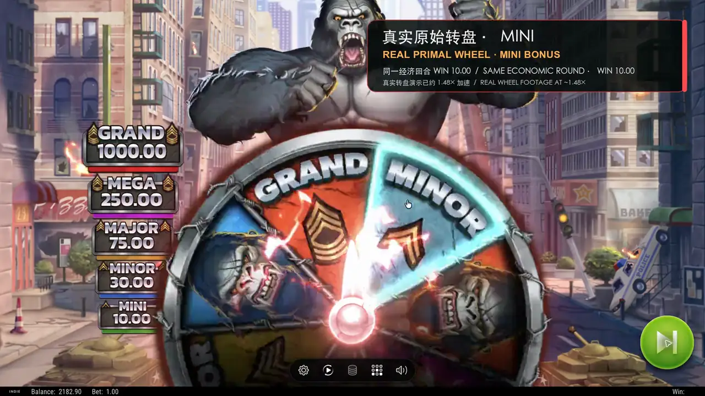

# Primal Rampage 个人独立商用级源码交付 / Independent Commercial-Grade Source Delivery

<!-- personal-independent-project -->
> **个人独立项目说明：** 本仓库的工程实现与交付文档由个人独立开发者维护，并按商用级源码交付标准建设。
> 文中的生产、运营、平台、安全、审计、法务、合规与审批角色均为采用方在外部环境中需要落实的职责；
> 仓库内容不代表已上线或已获得服务等级、商业授权、素材授权或监管认证，第三方组件与素材仍受各自许可和权利边界约束。
>
> **Independent-project notice:** The engineering implementation and delivery documentation in this repository are maintained by an independent developer and are built toward a commercial-grade source-delivery standard. Production, operations, platform, security, audit, legal, compliance, and approval roles described here remain responsibilities that an adopter must establish in its external environment. Repository content does not mean that the system is live or that any service level, commercial licence, asset licence, or regulatory certification has been granted. Third-party components and assets remain subject to their respective licences and rights boundaries.

## 24 秒本地全栈演示 / 24-second local full-stack demo

点击上方海报播放 24 秒演示。视频展示本地 Docker 环境中的真实转轮与 Primal Wheel、系统游戏声，以及同一回合的 Go RGS `spin` / `result_ack` 日志与 PostgreSQL `COMMITTED` 结算（`WIN 10.00`）。所有数据均为本机合成测试数据；该演示不是生产运行、真钱游戏、监管认证、商业授权或上线验收的证明。

Click the poster above to play the 24-second demo. It shows real local reels and the Primal Wheel in a Docker environment, captured system game audio, and the same round's Go RGS `spin` / `result_ack` logs alongside its PostgreSQL `COMMITTED` settlement (`WIN 10.00`). All data is synthetic and generated locally. The demo is not evidence of production operation, real-money gaming, regulatory certification, commercial licensing, or go-live acceptance.

为加快 GitHub 仓库首屏加载，README 只加载约 85 KB 的静态 WebP 海报；约 7 MB、支持 faststart 的 MP4 仅在点击后加载。

For fast GitHub repository rendering, the README initially loads only a static WebP poster of about 85 KB. The approximately 7 MB faststart MP4 is loaded only after a click.

媒体清单固定成片与海报的 SHA-256、精确字节数、24 秒时长、分辨率及 faststart 顺序，并由 `make verify-demo-media` 回归检查。

The media manifest pins the video and poster SHA-256 values, exact byte sizes, 24-second duration, dimensions, and faststart ordering; `make verify-demo-media` enforces them in regression checks.

## 项目与目标架构 / Project and target architecture

本仓库由个人独立开发者维护，按商用级源码交付标准建设。目标生产架构采用 AWS 多可用区集群：静态 Web 发布到 Amazon S3 并通过 CloudFront OAC 分发，公共 API 经 Route 53、AWS WAF、ALB 进入 Amazon EKS，权威交易状态存储在 Amazon RDS for PostgreSQL Multi-AZ 实例。

This repository is maintained by an independent developer and is built toward a commercial-grade source-delivery standard. The target production architecture uses an AWS multi-Availability Zone cluster: static web content is published to Amazon S3 and distributed through CloudFront OAC; public API traffic reaches Amazon EKS through Route 53, AWS WAF, and an ALB; authoritative transaction state is stored in an Amazon RDS for PostgreSQL Multi-AZ instance.

项目源码位于 [`slots-game/`](slots-game/)，持续集成与受保护发布工作流源码位于 [`.github/workflows/`](.github/workflows/)。正式评审从以下入口开始：

Project source is under [`slots-game/`](slots-game/), while continuous-integration and protected-release workflow sources are under [`.github/workflows/`](.github/workflows/). Start a formal review from these entry points:

- [项目交付总览 / Delivery overview](slots-game/README.md)
- [AWS 正式生产架构 / AWS production architecture](slots-game/docs/aws-production-architecture.md)
- [AWS 正式生产部署 / AWS production deployment](slots-game/docs/aws-production-deployment.md)
- [AWS 正式生产运维 / AWS production operations](slots-game/docs/aws-production-operations.md)
- [DDoS 威胁模型与演练边界 / DDoS threat model and exercise boundaries](slots-game/docs/ddos-threat-model.md)
- [通用 Kubernetes/Helm 应用交付 / Generic Kubernetes and Helm application delivery](slots-game/deploy/cluster-production/README.md)
- [Web 素材权属与发布门禁 / Web asset rights and release gates](slots-game/web/ASSETS.md)
- [支持与响应边界 / Support and response boundaries](SUPPORT.md)

当前源码交付元数据版本由 [`slots-game/VERSION`](slots-game/VERSION) 唯一声明。版本文件、变更记录、Web 包元数据、Helm Chart 和发布示例必须由机器门禁保持一致；只有受保护 Tag、GitHub Release 说明以及 OCI/SBOM/来源证明/签名证据全部完成后，才构成正式发布。

[`slots-game/VERSION`](slots-game/VERSION) is the sole declaration of the current source-delivery metadata version. Automated gates must keep the version file, changelog, web package metadata, Helm Chart, and release examples aligned. A formal release exists only after the protected tag, GitHub Release notes, and OCI/SBOM/provenance/signature evidence are all complete.

macOS Docker Compose 仅用于开发、集成与端到端验收，不是目标生产拓扑，也不能作为 AWS 高可用、灾难恢复或安全控制已经生效的证明。

Docker Compose on macOS is only for development, integration, and end-to-end acceptance. It is not the target production topology and cannot prove that AWS high availability, disaster recovery, or security controls are active.

本仓库同时交付应用源码、容器构建、Helm Chart、验证门禁与应用专属 AWS Terraform。`slots-game/infra/terraform/` 可创建 VPC、EKS、RDS、ElastiCache Valkey、ECR、Secrets Manager 元数据、S3/CloudFront、应用 API Regional WAF、AMP、CloudWatch、备份与归档基线；采用方的 AWS 基础环境仍必须提供账号、state/部署身份、DNS、ACM 证书、可选 Shield Advanced 订阅和组织级安全能力。源码中存在 IaC 不等于任何 AWS 账号已经执行 `plan`/`apply` 或通过上线验收。

The repository delivers application source, container builds, a Helm Chart, verification gates, and application-specific AWS Terraform. `slots-game/infra/terraform/` can create VPC, EKS, RDS, ElastiCache Valkey, ECR, Secrets Manager metadata, S3/CloudFront, an application API Regional WAF, AMP, CloudWatch, and backup/archive baselines. The adopter's AWS foundation must still supply the account, state and deployment identity, DNS, ACM certificates, an optional Shield Advanced subscription, and organisation-level security capabilities. The presence of IaC does not mean that any AWS account has run `plan` or `apply`, or passed go-live acceptance.

运行密码、私钥、数据库、日志、发布审批和构建产物不得进入 Git。正式秘密由 AWS Secrets Manager 管理并以最小权限注入工作负载；本机验收秘密由脚本写入仓库外受限状态目录。

Runtime passwords, private keys, databases, logs, release approvals, and build artifacts must not enter Git. Production secrets are managed through AWS Secrets Manager and injected into workloads with least privilege. Local-acceptance secrets are written by scripts to a restricted state directory outside the repository.

## 许可与商业发布边界 / Licensing and commercial-release boundaries

本仓库当前没有提供根级源码 `LICENSE`，因此不能把公开可见或可评审误解为已经授予开源、复制、再分发或商业使用许可。权利主体与授权条款必须由仓库所有者在正式对外发布前提供并经法律评审；本仓库不会代填权利主体或凭空生成商标、著作权证明。

The repository currently provides no root-level source `LICENSE`. Public visibility or reviewability therefore must not be interpreted as a grant of permission for open-source use, copying, redistribution, or commercial use. Before an external release, the repository owner must provide the rights holder and licence terms and obtain legal review. This repository does not invent a rights holder or fabricate trademark or copyright evidence.

Go 与 Web 开源依赖的分发声明分别见 [`server/THIRD_PARTY_NOTICES.txt`](slots-game/server/THIRD_PARTY_NOTICES.txt) 和 [`web/public/THIRD_PARTY_NOTICES.txt`](slots-game/web/public/THIRD_PARTY_NOTICES.txt)。游戏运行素材还受[逐文件权属与哈希审批门禁](slots-game/web/ASSETS.md)约束；仓库内缺少可审计权属材料的资源不得被宣称为全部原创或已获商业分发授权。

Distribution notices for Go and web open-source dependencies are provided in [`server/THIRD_PARTY_NOTICES.txt`](slots-game/server/THIRD_PARTY_NOTICES.txt) and [`web/public/THIRD_PARTY_NOTICES.txt`](slots-game/web/public/THIRD_PARTY_NOTICES.txt), respectively. Runtime game assets are also subject to the [per-file rights and hash approval gate](slots-game/web/ASSETS.md). Assets without auditable rights evidence in the repository must not be described as wholly original or authorised for commercial distribution.

本仓库当前为公开仓库，受保护 LFS 素材已经可以被仓库读者下载，因此外部授权必须覆盖当前的公开源码与 LFS 分发。在取得该授权前，仓库所有者应将仓库转为私有或移除/替换相关素材；本交付不会擅自改变仓库可见性。

This repository is currently public, and protected LFS assets can already be downloaded by repository readers. External authorisation must therefore cover the current public source and LFS distribution. Until that authorisation is obtained, the repository owner should make the repository private or remove or replace the affected assets. This delivery does not change repository visibility without permission.
