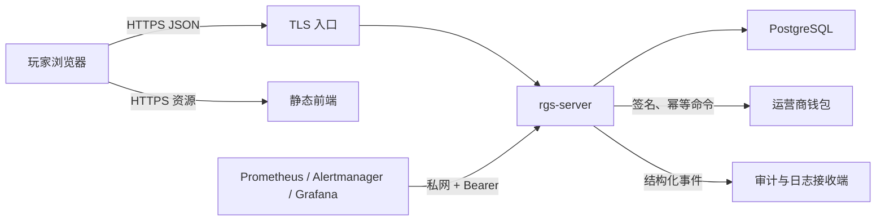
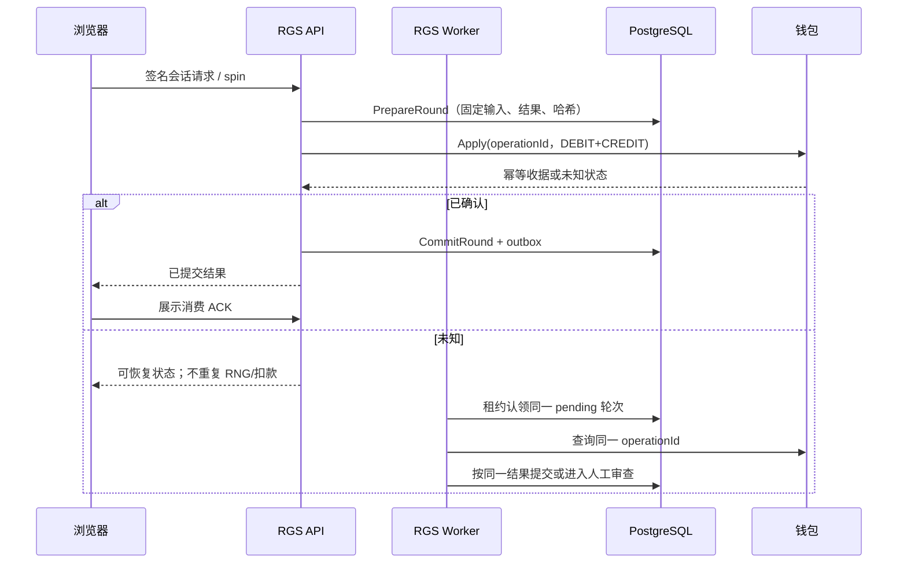

# 生产架构

AWS 是本仓库唯一正式生产主线。正式云架构、部署和运行责任分别以
[AWS 正式生产架构](aws-production-architecture.md)、
[AWS 正式生产部署](aws-production-deployment.md)和
[AWS 正式生产运维](aws-production-operations.md)为准。
高并发缓存、异步边界、日志、弹性、数学版本和冷热数据治理必须同时遵守
[高并发性能与数据生命周期契约](performance-optimization-contract.md)。

本文保留应用级不变量、macOS Compose 本地集成验收细节和可移植 Kubernetes Chart 契约，便于开发
排障与跨环境评审。下面的 Compose 树不是公司生产拓扑；“公司集群”章节描述的是通用应用交付
能力，不代表 AWS 账号、VPC、EKS、RDS、CloudFront、WAF 或监控平台已经创建。

## 系统边界



浏览器是不可信的表现层。RGS 是会话、余额、RNG、轮次、派彩、特性状态和结果顺序的唯一事实
来源。入口只允许 HTTPS RGS，不提供开发传输回退。

## 本地集成验收部署树

下面的树以 `slots-game-production` Compose 项目为根，描述本地集成验收实例的实际端口、网络、服务、
初始化顺序和持久化边界。只有标为“宿主机回环入口”的端口会发布到 macOS；数据库、业务服务和
运维监听器均不直接发布。网络分支表示允许的连接路径，不代表多网卡容器按端口绑定接口；这类容器
在全部已加入网络上监听，并依靠内部网络、TLS、Bearer、签名和应用鉴权共同限制访问。

```text
slots-game-production
├── 宿主机信任边界（macOS，仅绑定 127.0.0.1）
│   ├── 8443/TCP  HTTPS 统一入口
│   │   ├── slots.localhost
│   │   │   ├── /operator/、/launch、/api/v1/launches → local-operator
│   │   │   └── 其余静态资源 → web
│   │   └── rgs.localhost
│   │       └── /operator/v1/*、/client/v1/*、/healthz → rgs-server 公共监听器
│   ├── 9090/TCP  Prometheus 查询与规则状态
│   ├── 3000/TCP  Grafana 管理界面
│   ├── 9093/TCP  Alertmanager TLS 代理
│   │   ├── /healthz：不含状态的公开存活探针
│   │   └── 其余管理路径：Bearer 鉴权后转发
│   └── 24224/TCP Vector Fluent 日志入口，仅供本机 Docker 日志驱动
│
├── 一次性初始化与迁移链（成功退出后才允许常驻服务启动）
│   ├── service-volume-init
│   │   ├── network_mode=none，不创建任何网络接口
│   │   ├── 把宿主机 0600 源秘密按最小集合分发到命名卷
│   │   ├── 写入渲染后的 Prometheus、Grafana、证书和令牌配置
│   │   └── 收紧卷目录、文件所有者与权限
│   ├── postgres
│   │   └── TLS verify-full、SCRAM、私有 database 网络、持久卷 postgres_data
│   ├── rgs-migrator
│   │   └── 使用迁移角色执行 up；不持有运行时服务入口
│   ├── local-operator-bootstrap
│   │   └── 创建并收敛 owner/runtime 两个最小权限角色，生成分离 DSN
│   ├── local-operator-migrate
│   │   └── 使用 owner 角色迁移账户、钱包操作、回滚和 nonce 表
│   └── backup-policy
│       └── 在两套 schema 就绪后建立只读备份角色与精确授权
│
├── edge 内部网络（无公网 NAT）
│   ├── ingress：Nginx TLS 终止、SNI/Host 白名单、HSTS、正文与超时上限
│   ├── web：只读 Nginx 静态站点，不包含服务端秘密
│   ├── rgs-server:8080：生产 REST 公共业务面
│   │   ├── 会话交换与刷新
│   │   ├── 权威旋转、轮次状态与待交付结果恢复
│   │   └── 展示完成后的幂等结果确认
│   └── local-operator:8443：本机运营入口与签名 launch 发起端
│
├── database 内部网络（不发布宿主机端口）
│   ├── postgres:5432
│   │   ├── rgs 数据库：会话、轮次、nonce、定义版本/摘要、结果游标、事务性发件箱
│   │   └── local_operator 数据库：账户、钱包操作、回滚和防重放 nonce
│   ├── rgs-server：仅挂载 rgs_runtime 低权限 DSN
│   ├── local-operator：仅挂载 local_operator_runtime 低权限 DSN
│   ├── rgs-migrator：仅在启动阶段挂载 rgs_migrator DSN
│   ├── local-operator-bootstrap / migrate：仅在启动阶段使用管理与 owner DSN
│   └── backup：只读连接两库，生成备份、归档、SHA-256 清单和原子状态
│
├── audit 内部网络
│   ├── rgs-server 事务性发件箱
│   └── local-operator /audit
│       ├── 校验独立 Bearer、HMAC、事件编号与幂等键
│       └── 写入有界、可轮转的 operator_data/audit 分段文件
│
├── log_egress 内部网络
│   ├── rgs-server 标准输出 → Docker Fluent 日志驱动 → 127.0.0.1:24224
│   ├── vector
│   │   ├── 解析结构化 JSON、固定 route、删除凭据/正文/堆栈等敏感字段
│   │   ├── 使用有界磁盘缓冲 vector_data
│   │   └── HTTPS + Bearer → local-operator /logs
│   └── local-operator /logs → 有界、可轮转的 operator_data/logs 分段文件
│
├── operations 与 observability 内部网络
│   ├── rgs-server:8081 私有运维面
│   │   ├── /healthz：进程存活状态
│   │   ├── /readyz：数据库、密钥、定义和工作器就绪状态
│   │   └── /metrics：Bearer 保护、低基数 Prometheus 指标
│   ├── vector:9598：采集器内部缓冲、错误、丢弃与交付指标
│   ├── local-operator:8443/metrics：钱包、审计、日志、告警和容量指标
│   ├── prometheus
│   │   ├── 抓取 RGS、Vector、local-operator 与自身
│   │   ├── 保留 15 天且最多 1 GiB 的 prometheus_data
│   │   └── 计算就绪、错误率、延迟、容量、积压、备份新鲜度等规则
│   └── grafana
│       ├── 只从 Prometheus 查询
│       ├── 禁止匿名注册与在线插件安装
│       └── 仪表盘和本机管理状态保存在 grafana_data
│
├── alert 内部网络
│   ├── prometheus → alertmanager:9093
│   ├── alertmanager
│   │   ├── 分组、抑制和重复间隔来自只读 alertmanager.yml
│   │   ├── 静默、通知日志等运行状态保存在 alertmanager_data
│   │   └── HTTPS + Bearer → local-operator /alerts
│   ├── local-operator /alerts
│   │   └── 幂等写入 operator_data/alerts 分段文件
│   └── alert-proxy
│       └── 发布 TLS 存活探针，并把经 Bearer 保护的管理接口发布到 127.0.0.1:9093
│
├── 持久化树
│   ├── Docker 命名卷
│   │   ├── postgres_data：两套数据库权威状态
│   │   ├── operator_data：审计、日志、告警分段档案
│   │   ├── prometheus_data / grafana_data / alertmanager_data：观测状态
│   │   ├── vector_data：未交付日志的有界磁盘缓冲
│   │   ├── *_secrets：按服务拆分的只读运行时秘密
│   │   └── *_bundle：渲染后配置、根 CA 与只读仪表盘
│   └── 宿主机状态根 ~/.local/share/slots-game-production
│       ├── secrets：源密钥、证书、密码、令牌和生产配置，目录 0700、文件 0600
│       ├── rendered：经静态契约校验的观测配置
│       └── backups
│           ├── rgs PostgreSQL 自定义格式备份
│           ├── local_operator PostgreSQL 自定义格式备份
│           ├── audit/logs/alerts 文件档案
│           └── SHA-256 完成清单与原子备份状态
│
│       宿主机 verify-backups.sh 按需在无网络临时 PostgreSQL 中恢复两库并检查外部档案；
│       验收结果输出到当前终端，不伪装为 backups 目录中的持久证明。
│
├── 密钥与信任树
│   ├── 本机根 CA
│   │   ├── ingress、PostgreSQL、local-operator、alert-proxy 服务端证书
│   │   └── 仅公共 CA 证书进入运行容器；CA 私钥只留在宿主机 secrets
│   ├── operator-request：local-operator 私钥签名 → RGS 公钥验签
│   ├── operator-response：RGS 私钥签名 → local-operator 公钥验签
│   ├── wallet-request：RGS 私钥签名 → local-operator 钱包公钥验签
│   ├── wallet-response：local-operator 私钥签名 → RGS 公钥验签
│   ├── access-token：RGS 私钥签发、RGS 公钥验证并绑定会话
│   ├── definition-approval：离线审批私钥签名、运行时仅挂载公钥
│   └── launch/outbox/operations/log/alert：用途隔离的独立 HMAC 或 Bearer
│
└── 源码与发布树
    ├── verify-source-conformance：锁文件安装、测试、竞态、数据库与配置门禁
    ├── build-rgs：全新检出、无发布秘密地构建和扫描 RGS 候选
    ├── build-approved-web：独立审批环境中校验素材清单后构建 Web 候选
    └── publish-sign：仅复核不可变候选，随后推送、生成 SBOM/来源证明并签名
```

### 启动依赖树

```text
web（无显式 depends_on，可独立启动并接受自身健康检查）

service-volume-init（成功退出）
├── postgres（健康）
│   ├── rgs-migrator（成功退出）
│   └── local-operator-bootstrap（成功退出）
│       └── local-operator-migrate（成功退出）
│           └── local-operator（健康）
│               ├── vector（启动；同时要求 service-volume-init 完成）
│               ├── alertmanager（健康；同时要求 service-volume-init 完成）
│               │   └── alert-proxy（启动并接受自身健康检查）
│               └── ingress 的运营端上游条件满足
├── rgs-migrator（成功退出） + local-operator（健康） + vector（已启动）
│   └── rgs-server（启动并接受自身健康检查）
│       ├── ingress（还要求 web、local-operator 健康；启动时即发布 8443）
│       └── prometheus（还要求 alert-proxy、vector 已启动）
│           └── grafana（Prometheus 自身健康后启动）
└── rgs-migrator + local-operator-migrate（均成功退出） + postgres（健康）
    └── backup-policy（成功退出）
        └── backup（周期备份、状态健康检查；完整恢复验收由宿主脚本按需执行）
```

常驻容器均使用只读根文件系统、启用 `no-new-privileges`，并限制 PID、内存与 CPU。除 PostgreSQL
外的常驻容器删除全部 Linux capability；PostgreSQL 为官方入口与持续运行保留 `CHOWN`、
`DAC_OVERRIDE`、`FOWNER`、`SETGID`、`SETUID`，初始化容器只获得其任务所需的精确 capability。
`host_access` 网络关闭 IP masquerade，只承担回环端口发布，不给容器提供通用公网出口。

## 通用 Kubernetes 应用拓扑树

下面的树与 `deploy/cluster-production/chart` 一一对应，并作为 AWS EKS 应用层的可移植基础。AWS
正式落地还必须叠加 [AWS 正式生产架构](aws-production-architecture.md) 的边缘、S3/CloudFront、
身份、RDS、监控和灾备能力。标为“公司平台外部能力”的节点是部署前置
条件，Chart 只引用或记录它们，不会伪造 WAF 粗粒度保护、外部 Valkey/数据库、钱包、审计、密钥同步、
Prometheus Operator 或 Web 蓝绿控制器已经落地。集群 Chart 不部署 `local-operator`、本机
PostgreSQL 或本机 Compose 观测栈。

```text
公司 Kubernetes 生产集群（Kubernetes >= 1.30，当前签名制品仅 linux/amd64）
├── 公司平台外部能力（不由本 Chart 创建）
│   ├── DNS、证书系统与 Ingress Controller
│   ├── API Gateway / WAF
│   │   └── 未认证攻击面、IP/路径和粗粒度容量保护，不承担已验证身份精确限流
│   ├── 三个及以上带 topology.kubernetes.io/zone 的可用区
│   ├── Metrics Server 与 Prometheus Operator
│   ├── 节点级日志管道：stdout/stderr 脱敏、有界缓冲、集中归档与管道告警
│   ├── 外部高可用 PostgreSQL
│   ├── 外部高可用 Valkey：仅供 API 跨副本身份共享准入，不是资金幂等权威
│   ├── 外部幂等钱包与外部幂等审计接收端
│   ├── 外部密钥同步器：发布前创建版本化、建议 immutable 的 Secret
│   └── Web 蓝绿控制器或带 release ID 前缀的版本隔离 CDN
│
├── TLS 与入口树
│   ├── API Ingress（ingress.apiHost）
│   │   ├── 引用独立 apiTLSSecretName
│   │   ├── 强制写入入口实现真实支持的 HTTP→HTTPS 策略注解
│   │   ├── 记录共享准入/WAF 责任方与 tlsEnforcementProvider 审计标签
│   │   └── HTTPS / → RGS 公共 Service:80 → Pod:8080
│   ├── Web Ingress（ingress.webHost）
│   │   ├── 引用独立 webTLSSecretName
│   │   ├── 强制写入同一 TLS 跳转策略
│   │   ├── 记录必填 webVersionIsolationProvider 审计标签
│   │   └── HTTPS / → Web Service:80 → Pod:8080
│   └── operations Service 没有 Ingress、LoadBalancer 或 NodePort
│
├── RGS API 无状态计算树
│   ├── RGS API Deployment（默认 3 个暖副本，RollingUpdate maxUnavailable=0/maxSurge=1）
│   │   ├── HPA：3..12，CPU 65% 与内存 75% 双指标
│   │   ├── PDB：minAvailable=2
│   │   ├── 三可用区 DoNotSchedule、主机拓扑分散、主机反亲和偏好
│   │   ├── startup/readiness：/service-probe → 私有 8081/readyz + operations Bearer
│   │   ├── liveness：公共 8080/healthz，仅证明进程存活
│   │   ├── preStop 5 秒摘流 + 应用 shutdown 30 秒 + 至少 5 秒调度余量
│   │   ├── 不启动钱包恢复、Outbox 投递或 nonce/launch 清理循环
│   │   ├── logPipelineProvider 标签记录公司节点日志责任方
│   │   └── 非 root 65532、只读根、RuntimeDefault seccomp、ALL capability drop
│   ├── RGS API 公共 ClusterIP Service
│   └── RGS API operations ClusterIP Service:8081
│
├── RGS Worker 恢复与投递树
│   ├── RGS Worker Deployment（默认 2 副本，RollingUpdate maxUnavailable=0/maxSurge=1）
│   │   ├── HPA：2..6，CPU 70% 与内存 80% 双指标，扩缩窗口比 API 更保守
│   │   ├── PDB：minAvailable=1
│   │   ├── 与 API 独立的资源、数据库连接池和终止预算
│   │   ├── 运行钱包 pending/unknown 恢复、Outbox 投递和 nonce/launch 有界清理
│   │   ├── Pod 名进入 RGS_OUTBOX_OWNER；多副本共享 PostgreSQL 租约/围栏
│   │   ├── startup/readiness：/service-probe → 私有 8081/readyz + operations Bearer
│   │   ├── readiness 额外验证 Outbox 循环新鲜度、存储访问和 backlog 最大年龄
│   │   ├── liveness：运维 8081/healthz；没有公网监听器或公网 Service
│   │   └── 与 API 相同的非 root、只读根、seccomp、capability 与拓扑边界
│   └── RGS Worker operations ClusterIP Service:8081
│
├── Web 无状态表现树
│   ├── Web Deployment（默认 3 副本，RollingUpdate maxUnavailable=0/maxSurge=1）
│   │   ├── HPA：3..12，CPU 70% 与内存 80% 双指标
│   │   ├── PDB：minAvailable=2
│   │   ├── 与 RGS 相同的三可用区/主机分散约束
│   │   ├── startup/readiness：/readyz；liveness：/livez
│   │   ├── 内存 emptyDir 仅供 /tmp 与 Nginx cache，根文件系统只读
│   │   ├── logPipelineProvider 与 webVersionIsolationProvider 进入 Pod 审计标签
│   │   └── 非 root 101、RuntimeDefault seccomp、ALL capability drop
│   └── Web ClusterIP Service
│
├── 监控树
│   ├── 两个 ServiceMonitor（由 Chart 创建，CRD/控制器由公司平台提供）
│   │   ├── selector 分别精确匹配 API 与 Worker operations Service
│   │   ├── jobLabel 分别读取 slots-game.io/metrics-job=slots-rgs 与 slots-rgs-worker
│   │   ├── /metrics、HTTP 私网、Bearer SecretKeySelector
│   │   └── 只引用 operationsBearer Secret，不读取钱包/签名/数据库材料
│   ├── PrometheusRule（由 Chart 创建，CRD/求值器/Alertmanager 由公司平台提供）
│   │   ├── ruleLabels 必须匹配公司 Prometheus 规则发现策略
│   │   ├── 固定 API/Worker job + 当前 namespace，避免跨角色或跨环境串告警
│   │   └── API/Worker 目标与就绪、5xx、容量、HPA 失效、共享准入、认证重放、钱包未知、完整性、outbox、DB 池十五条规则
│   └── Prometheus Pod → NetworkPolicy 允许 → operations Service:8081 → Alertmanager 外部路由
│
├── 外部 Secret 引用树（六个职责 Secret 名称强制互异）
│   ├── runtimeDatabase → RGS API/Worker：rgs_runtime verify-full DSN 与可选数据库 CA
│   ├── migratorDatabase → migrator：rgs_migrator DSN
│   ├── operationsBearer → RGS API/Worker 单文件 + ServiceMonitor credentials
│   ├── sharedAdmission → 仅 RGS API：活动 ACL username/password、键摘要 HMAC、精确 TLS 根 CA
│   ├── apiRuntimeAssets → 仅 RGS API
│   │   ├── operators v2、定义、定义批准与独立批准公钥
│   │   ├── launch HMAC、access-token 签发、运营请求验证/响应签名与钱包密钥
│   │   └── 系统公开根与钱包私有根组成的 trust bundle
│   └── workerRuntimeAssets → 仅 Worker
│       ├── 钱包视图 operators v2、定义、定义批准与独立批准公钥
│       ├── 钱包请求签名/响应验证、outbox HMAC/Bearer/专用根 CA 与 trust bundle
│       └── 明确不含 launch HMAC、access-token 签发和运营请求/响应私钥
│
├── NetworkPolicy 树
│   ├── 全部 Chart Pod 默认 ingress+egress deny
│   ├── Web ingress：仅入口 namespaceSelector AND podSelector → 8080
│   ├── Web egress：无允许规则
│   ├── RGS API ingress
│   │   ├── 入口控制器 → 8080
│   │   └── 受标记 Prometheus → 8081
│   ├── RGS Worker ingress：仅受标记 Prometheus → 8081
│   ├── RGS API/Worker 公共 egress
│   │   ├── 精确 CoreDNS selectors → TCP/UDP 53
│   │   ├── 外部 PostgreSQL IPv4 /24..32 → 配置端口
│   │   └── 外部钱包 IPv4 /24..32 → 配置端口
│   ├── RGS API 专属 egress：共享 Valkey IPv4 /24..32 → TLS 6379
│   ├── RGS Worker 专属 egress：外部审计 IPv4 /24..32 → 配置端口
│   └── migrator 临时策略：默认拒绝，仅 DNS + PostgreSQL；成功后 post hook 删除
│
├── 数据库 pre-deploy hook 树
│   ├── pre-install：migrator Job 执行 up，advisory lock 内创建/校验完整 schema
│   ├── pre-upgrade：同一 Job 只执行 verify，不自动应用新迁移
│   ├── 失败：阻断 Helm，保留同名 Job 与最小 NetworkPolicy 供排障
│   └── 成功：hook-succeeded 删除 Job，post hook 清理临时 NetworkPolicy
│
├── 容量与安全树
│   ├── 每容器 CPU、内存、ephemeral-storage requests/limits
│   ├── API/Worker 分别约束 DB open、in-flight 和 listener connections
│   ├── 发布峰值连接预算 = API 滚动峰值 + Worker 滚动峰值
│   │   + 两类 terminating Pod 重叠 + migrator/平台/应急保留量
│   ├── 禁用 ServiceAccount token、service links、hostNetwork/PID/IPC 与进程共享
│   └── 所有镜像必须 repository@sha256；Chart 不接受可变 tag
│
└── 发布与版本边界
    ├── install：migrator up → RGS API/Worker 与 Web 创建
    ├── 普通 upgrade：schema/数学定义身份完全相同 → migrator verify → API/Worker 滚动
    ├── schema 变化：维护窗口或已验证的扩展—兼容—收缩协议，禁止普通零停机滚动
    ├── 数学定义变化：明确入口分群并排空旧会话，或先实现多定义加载协议
    ├── Web stable public 素材：必填版本隔离提供方并审计标记，原生混部滚动不能作证明
    └── GitOps：必须实现等价 Helm pre/post hook 顺序；rendered.yaml 只供评审，禁止直接 apply
```

## 服务职责

| 组件 | 职责 | 禁止事项 |
| --- | --- | --- |
| `rgs-server` API 角色 | 认证、会话、轮次协调、首次钱包调用、公网与运维探针 | 不执行迁移、恢复或 Outbox 投递，不在日志输出凭据 |
| `rgs-server` Worker 角色 | 钱包未知结果恢复、Outbox 投递、凭据清理与独立运维探针 | 不开放公网监听器，不接收玩家请求 |
| `rgs-migrator` | 有序执行并验证 PostgreSQL schema | 不承载业务流量 |
| `local-operator` | 本机运营入口、签名钱包、审计/日志接收 | 不接管 RGS 结算 |
| Web | 校验并展示权威结果 | 不生成网格、派彩或余额 |
| PostgreSQL | 会话、轮次、nonce、发件箱和恢复权威状态 | 不向公网暴露 |
| Vector | 收集、脱敏并限流转发结构化日志 | 不持有业务数据库凭据 |
| Prometheus | 通过私网 Bearer 抓取指标并计算告警 | 不访问公共业务端点 |

## 轮次事务



同一轮次只允许稳定 `operationId` 对应一条原子钱包命令。钱包结果未知时保留恢复状态并查询原
命令；禁止重新运行 RNG、创建新轮次或重复扣款。结果展示 ACK 只推进交付状态，不改变经济结果。

## 数据与恢复

- 金额使用最小货币单位的规范十进制字符串；数据库使用受约束整数/文本表示；
- `roundId`、`requestId`、`sessionId`、定义版本/哈希、nonce 和结果哈希精确绑定；
- 事务性发件箱与轮次提交处于同一数据库事务；发送失败由租约工作器重试；
- 浏览器只持久化不含秘密的恢复指纹，服务端按 cursor 重放已提交结果；
- 备份必须加密、校验、保留并定期执行恢复演练；恢复后先迁移验证，再开放 `/readyz`。

## 安全与资源控制

- 公共业务监听器和私有运维监听器分离；`/readyz`、`/metrics` 使用 secret-file Bearer；
- PostgreSQL、钱包、审计和入口 TLS 使用独立证书/密钥，在线容器不得挂载 CA 私钥；
- 运行时与迁移器使用不同数据库角色，连接池、并发请求、连接数、正文大小和超时均有硬上限；
- CORS、CSP `connect-src` 与 `frame-ancestors` 由同一组精确构建 origin 生成，禁止通配符；
- 日志在入口和采集器双重脱敏，不记录启动码、token、签名、DSN、请求体或玩家隐私字段；
- 所有容器以非 root、只读根文件系统、最小 capability 和固定镜像 digest 运行。

## 发布与可观测性

生产发布顺序：数据库角色初始化 → migrator `up` → migrator `verify` → RGS/钱包启动 →
认证 `/readyz` → 入口放量。只有数据库模式清单与数学定义身份均未改变的版本才允许普通滚动启
动；模式或定义变更须遵守多副本集群运行契约中的协调切换边界。Prometheus 监控就绪、错误率、
延迟、连接/请求预算、数据库池、钱包恢复和发件箱积压；Alertmanager 经受限代理发送；Vector 使
用有界磁盘缓冲防止日志故障拖垮业务。

源码发布门禁包含锁文件安装、全量测试、竞态检测、vet/build、PostgreSQL conformance、生产配置
smoke、秘密/漏洞扫描、CycloneDX/SPDX SBOM、镜像扫描、来源证明和签名。正式运行手册见：

- [运营商集成](operator-integration.md)
- [数据库迁移](database-migrations.md)
- [故障恢复](failure-recovery.md)
- [访问令牌密钥轮换](access-token-key-rotation.md)
- [事务性发件箱](outbox-delivery.md)
- [多副本集群运行契约](cluster-runtime-contract.md)
- [安全控制](security-compliance.md)
