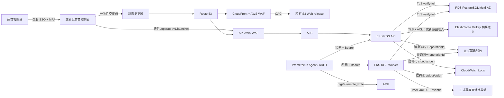
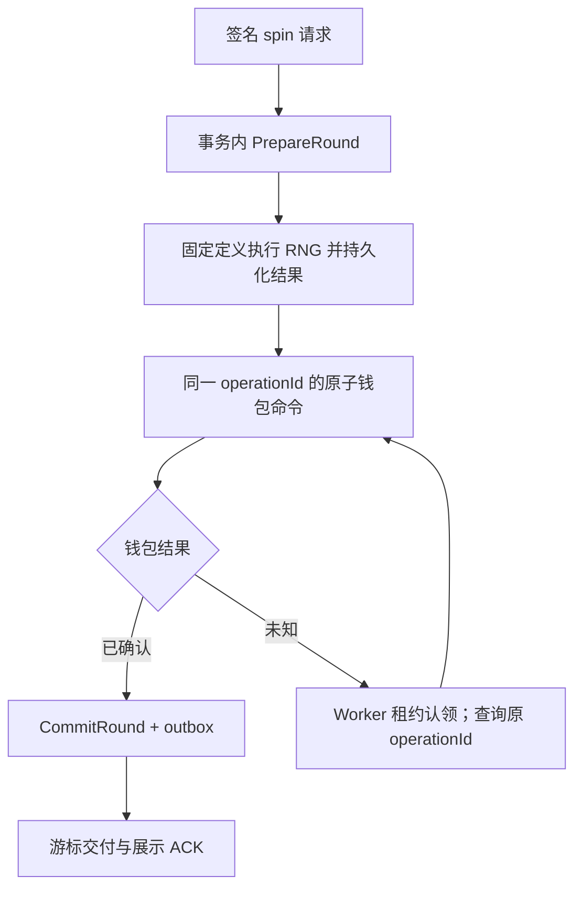

# AWS 正式生产架构

<!-- personal-independent-project -->
> **个人独立项目说明：** 本仓库的工程实现与交付文档由个人独立开发者维护，并按商用级源码交付标准建设。
> 文中的生产、运营、平台、安全、审计、法务、合规与审批角色均为采用方在外部环境中需要落实的职责；
> 仓库内容不代表已上线或已获得服务等级、商业授权、素材授权或监管认证，第三方组件与素材仍受各自许可和权利边界约束。

状态：AWS 目标架构与平台交付契约

基准更新时间：2026-08-21

本文定义本项目唯一的目标生产参考架构。它把应用能力与仓库内 `infra/terraform` 映射到 AWS
托管服务，并明确采用方 AWS 基础环境、运营商集成和采用方安全责任角色在目标账号中仍必须提供的能力。
本文和 Terraform 源码都不是资源已经创建的声明；AWS 实际状态只能由目标账号中受保护的
plan/apply、云资源清单与验收证据证明。

## 1. 架构结论

- Web 使用私有 Amazon S3 作为源站，通过 CloudFront Origin Access Control（OAC）读取；发布内容
  按不可变 `release ID` 隔离，禁止把 S3 bucket 设为公开网站。
- API 使用 Route 53、仓库 Terraform 自管的 Regional AWS WAF、internet-facing Application Load
  Balancer 和 Amazon EKS；AWS Load Balancer Controller 将 Kubernetes Ingress 映射为 ALB。
- 同一 `rgs-server` 制品以 API 和 Worker 两种显式角色部署：API 承担会话、RNG、轮次、首次钱包
  命令和派彩；Worker 承担钱包未知结果恢复、审计发件箱投递和凭据清理。两类角色共享 PostgreSQL
  权威事务模型并可独立扩容，但不能为了“微服务数量”拆散一次经济事务。
- 数据库基线是 Amazon RDS for PostgreSQL Multi-AZ **DB instance deployment**，运行时与迁移器
  使用分离角色和 `sslmode=verify-full`。RDS Proxy 只有在连接固定、会话状态和事务语义压测通过后
  才可启用。
- 采用方必须提供正式运营商控制面：管理员经企业 SSO、授权和审计后，由服务端签名调用
  `/operator/v1/launches` 并把一次性交接值传给玩家。不得把 `local-operator` 管理令牌或 operations
  Bearer 交给普通浏览器。
- 正式秘密存放在 AWS Secrets Manager，独立同步控制器通过 EKS Pod Identity 或等价短期身份读取
  指定版本；RGS/Web 不取得 AWS 身份。不得把长期 AWS 密钥或业务秘密写入 Git、镜像、Helm
  values 或命令行。
- 指标由集群内 Prometheus Agent 或 ADOT Collector 携带 operations Bearer 抓取，再
  `remote_write` 到 Amazon Managed Service for Prometheus；Amazon Managed Grafana 查询 AMP 与
  CloudWatch。结构化容器日志由 CloudWatch Observability EKS add-on 的 OpenTelemetry 管道采集。
- 数据库备份、CloudTrail/访问日志与必要归档执行跨账号、跨区域复制；备份保管库、KMS 密钥、保留
  期和恢复演练由采用方安全与平台责任角色审批。
- `local-operator`、本机 PostgreSQL、Compose Prometheus/Grafana/Vector 只属于本地验收，不得部署
  到 AWS 正式环境。

## 2. 生产架构树

下树中的“应用专属基础设施”由本仓库 `infra/terraform` 交付，其中包括 API Regional WAF；账号工厂、
state/部署身份、Route 53/ACM、静态 Web 的 CloudFront global WAF、可选 Shield Advanced/DRT 和组织级
安全能力由采用方 AWS 基础环境提供。仓库没有假装任何 AWS 账号已经执行这些源码。

```text
AWS Organizations
├── 管理账号
│   └── 组织策略、账号工厂、集中账单；不运行应用工作负载
├── 安全账号
│   ├── Security Hub、GuardDuty、Inspector 与集中安全告警
│   └── 跨账号只读审计角色
├── 日志归档账号
│   ├── 组织 CloudTrail、AWS Config、WAF/CloudFront/ALB 访问日志
│   └── 加密、对象锁定、生命周期与受控查询
├── 共享服务账号
│   ├── CI/CD 身份信任与 VPC 内一次性部署执行器
│   │   └── CodeBuild 托管 GitHub Actions runner 或等价短生命周期执行器
│   ├── 共享 DNS/证书或网络服务
│   └── ECR 复制策略与经审批的基础镜像
└── 工作负载账号（正式与非正式环境分离）
    └── 正式区域
        ├── 全球与边缘入口
        │   ├── Route 53 公共托管区与健康检查
        │   ├── AWS Certificate Manager 证书
        │   ├── CloudFront Web 分发
        │   │   ├── 企业 global AWS WAF：managed/rate 初始 Count，按证据分阶段 Block
        │   │   ├── OAC → 私有 S3 Web bucket
        │   │   ├── release router：把同一浏览器固定到不可变 release ID
        │   │   └── 访问日志 → 日志归档边界
        │   └── API 域名 → 仓库自管 Regional AWS WAF → 公网 ALB
        │       ├── body 8 KiB 直接 Block；header/managed/per-IP rate 初始 Count
        │       ├── 公网 /healthz 精确 Block；ALB target health 直连 Pod:8081/healthz
        │       ├── launch/spin 低阈值只计精确 POST；高阈值覆盖 GET/OPTIONS/POST，预检无旁路
        │       ├── 429 返回浏览器可读 Retry-After:30 + RATE_LIMITED edge marker
        │       ├── regional ACM + 固定 TLS 1.2/1.3 policy、仅 HTTPS listener、受控安全组
        │       └── IP target → 业务 Pod:8080；健康检查 → 私有 operations Pod:8081
        │
        ├── 正式运营商控制面（采用方负责的项目外部服务，非本 Chart）
        │   ├── 企业 SSO/MFA → RBAC/ABAC → 管理操作审计
        │   ├── 服务端保管用途限定的运营商请求签名密钥
        │   ├── 签名调用 RGS /operator/v1/launches
        │   └── 只向玩家交付一次性 launch 值，不暴露管理/operations 凭据
        │
        ├── 正式 VPC（至少 3 个可用区）
        │   ├── 公有边缘子网
        │   │   ├── ALB
        │   │   └── 每个活动可用区 NAT Gateway，或经验证的等价高可用 egress
        │   │       └── 仅供获批外部钱包/审计等路径；应用不得取得任意公网出口
        │   ├── 私有应用子网
        │   │   ├── EKS 托管控制面私有/受限 API endpoint
        │   │   ├── EKS 数据面：跨 3 个可用区的托管节点组或 Karpenter 节点
        │   │   ├── 系统命名空间
        │   │   │   ├── AWS Load Balancer Controller
        │   │   │   ├── EBS CSI、CoreDNS、Metrics Server
        │   │   │   ├── 经审批的 Secrets Manager → Kubernetes Secret 同步控制器
        │   │   │   ├── Prometheus Agent 或 ADOT Collector
        │   │   │   └── CloudWatch Observability EKS add-on
        │   │   └── slots-production 命名空间
        │   │       ├── rgs-server API Deployment（默认 3 个暖副本，跨区）
        │   │       │   ├── 公共 Service:8080，仅接受 ALB 业务入口且不提供 /healthz
        │   │       │   ├── operations Service:8081，接受受控 ALB target health 与监控抓取
        │   │       │   ├── HPA、PDB、拓扑分散、只读根、非 root
        │   │       │   ├── 精确 NetworkPolicy 与连接/并发硬上限
        │   │       │   └── 只允许数据库、钱包与共享限流存储出口，不访问审计接收端
        │   │       ├── rgs-server Worker Deployment（默认 2 副本，跨区）
        │   │       │   ├── 只开放私有 operations Service:8081，不创建公网 Service
        │   │       │   ├── 独立 PDB、资源、数据库池、就绪与终止预算
        │   │       │   ├── PostgreSQL 租约协调恢复、Outbox 和清理任务
        │   │       │   └── 审计接收端仅是 Worker 的获批出口
        │   │       ├── rgs-migrator Job
        │   │       │   └── 独立迁移角色；首次 up，普通升级只 verify
        │   │       └── API 共享准入客户端（仓库已实现）
        │   │           └── 只按已验证运营商/会话身份聚合，并不信任调用方 header
        │   ├── 隔离数据子网
        │   │   ├── RDS for PostgreSQL Multi-AZ DB instance
        │   │   │   ├── 主实例 + 跨可用区同步备用实例
        │   │   │   ├── KMS 加密、自动备份、PITR、事件订阅
        │   │   │   ├── rgs_runtime 最小 DML 角色
        │   │   │   ├── rgs_migrator 迁移角色
        │   │   │   └── 可选 RDS Proxy：必须先完成会话固定与事务一致性验证
        │   │   ├── ElastiCache Valkey Multi-AZ replication group
        │   │   │   └── TLS + A/B ACL 用户；只保存可丢弃的身份准入桶，不是资金幂等权威
        │   │   └── 正式钱包/审计专用连接目标或受控 egress gateway
        │   └── VPC endpoints
        │       ├── ECR API/DKR、S3、STS/EKS 身份
        │       ├── Secrets Manager、KMS、CloudWatch Logs/Monitoring
        │       └── 按实际解析路径补齐的私有 DNS 与安全组
        │
        ├── Web 发布边界
        │   ├── 私有 S3 bucket：Block Public Access、SSE-KMS、版本控制
        │   ├── releases/<release-id>/：只写一次的完整构建与素材清单
        │   ├── CloudFront OAC bucket policy：仅允许指定 distribution 读取
        │   ├── 活跃 release 路由：受保护流水线切换，可立即回退
        │   └── 旧 release：超过最长会话和回退窗口后才按保留策略清理
        │
        ├── 镜像与发布边界
        │   ├── ECR：tag immutability、加密、生命周期与跨区域复制
        │   ├── Inspector enhanced scanning
        │   ├── Cosign OIDC 或 AWS Signer 签名验证
        │   └── GitHub Actions OIDC → 环境专属发布角色，不保存静态 AWS key
        │       └── Helm/kubectl 在可访问私有 EKS endpoint 的 VPC 一次性执行器运行
        │
        ├── 密钥与配置边界
        │   ├── Secrets Manager：运行 DSN、迁移 DSN、operations Bearer、运行签名材料
        │   ├── EKS Pod Identity：仅每个确需 AWS API 的控制器/Agent 使用独立最小 IAM role
        │   ├── 同步控制器生成版本化、不可变的原生 Kubernetes Secret
        │   ├── ACM/KMS：用途、环境和账号隔离
        │   └── Kubernetes 原生 Secret 镜像（仅必要字段）
        │       └── 供 ServiceMonitor Bearer selector 使用，禁止包含其他私钥
        │
        ├── 可观测性边界
        │   ├── Prometheus Agent/ADOT
        │   │   ├── operations Bearer → /metrics
        │   │   ├── ServiceMonitor/规则与仓库告警契约对齐
        │   │   └── SigV4 remote_write → AMP workspace
        │   ├── AMP：指标存储、规则求值与 Alertmanager 集成
        │   ├── AMG：只读查询 AMP/CloudWatch，SSO 与最小权限
        │   ├── CloudWatch Logs：容器 stdout/stderr、保留期、脱敏与订阅
        │   ├── CloudWatch：EKS/RDS/ALB/WAF/CloudFront 平台指标与事件
        │   └── SNS/值班平台：分级、去重、升级和闭环
        │
        └── 备份与灾难恢复边界
            ├── RDS 自动备份与 PITR
            ├── AWS Backup vault：独立 KMS key、最小删除权限、Vault Lock
            ├── 跨账号副本 → 备份/安全账号
            ├── 跨区域副本 → 灾备区域
            ├── S3 版本与必要的跨区域复制
            ├── ECR 镜像、Git tag、SBOM、provenance、定义审批归档
            └── 定期恢复演练：新隔离环境恢复、校验、对账，禁止只检查备份状态
```

## 3. 请求与信任路径



浏览器、边缘 header、网络源地址和容器本地状态都不可信。运营商请求必须先验签，再按已验证身份
限流和消费 nonce；客户端请求必须先验证 access token，再按其不可变运营商与会话绑定限流。WAF
的 rate-based rule 适合传输层、IP 和攻击路径保护，但不能代替这种身份级跨副本全局限流。

## 4. 为什么 RGS 不按名义拆分



把 RNG、轮次、结算、钱包协调或恢复分别拆成可独立失败的网络服务，会引入分布式事务、重复扣款、
定义漂移和恢复顺序风险，而没有形成独立的业务所有权边界。因此正式形态是“可横向扩展的模块化
单体 RGS 的 API/Worker 角色 + 独立迁移器 + 外部运营商/钱包/审计服务”。这符合微服务交付的自治、不可变发布、
独立伸缩和清晰契约要求，但不以服务数量牺牲经济一致性。

允许独立演进的边界是：

- Web 静态表现层；
- 一次性数据库迁移器；
- 采用方正式运营商入口、钱包和审计系统；
- 边缘安全、API 共享准入、日志、指标与发布平台；
- 未来经协议、故障模式和对账验证后拆出的纯异步只读/分析消费者。

禁止在没有新一致性协议前拆出的边界是：

- 轮次准备与 RNG 结果持久化；
- 钱包 `operationId` 与轮次提交；
- 会话/定义绑定与待处理轮次恢复；
- 轮次提交与审计 outbox 原子写入。

## 5. 服务职责边界

| 单元 | 部署形态 | 权威职责 | 明确禁止 |
| --- | --- | --- | --- |
| Web | S3 + CloudFront | 启动、渲染、资源加载、调用 RGS | 生成 RNG、余额或派彩；保存长期 token |
| `rgs-server` API 角色 | EKS Deployment + HPA | 会话、RNG、轮次、首次钱包协调与派彩 | 执行 schema 迁移/恢复/Outbox；信任浏览器经济结果 |
| `rgs-server` Worker 角色 | EKS Deployment | 钱包未知结果恢复、Outbox 投递和凭据清理 | 开放公网端口；创建新的 RNG 结果或 operationId |
| `rgs-migrator` | EKS one-shot Job | `up`/`verify` schema，验证角色权限 | 承载业务流量；把迁移 DSN 交给运行时 |
| PostgreSQL | RDS Multi-AZ instance | 会话、轮次、nonce、租约、游标和 outbox 权威状态 | 公网暴露；与运行时共用管理角色 |
| PostgreSQL 可选读扩展 | 同区域 RDS read replica，默认关闭 | 仅承载经应用显式分类的非权威读取 | 接受写入；冒充 Multi-AZ standby、备份、Proxy 或跨区 DR |
| Valkey 共享准入 | ElastiCache Multi-AZ replication group | 跨 API 副本的新启动与 Spin 身份令牌桶 | 充当资金、轮次、钱包结果或 `operationId` 幂等权威 |
| 正式运营商控制面 | 采用方负责的项目外部服务 | SSO、授权、管理审计、签名启动与一次性交接 | 把管理 token/签名 key/operations Bearer 发给玩家 |
| 正式钱包 | 采用方或外部运营服务 | 余额、原子借贷、查询和回滚协议 | 用 `local-operator` 代替；忽略幂等查询 |
| 正式审计接收端 | 采用方审计服务 | 持久化、验签、按 `eventId` 去重与归档 | 仅内存接收；未持久化即返回成功 |
| Prometheus Agent/ADOT | EKS 平台组件 | 认证抓取、限流处理、远程写入 AMP | 访问钱包/数据库私钥；把 token 写进配置日志 |
| CloudWatch 日志管道 | EKS add-on + CloudWatch | 节点采集、元数据、脱敏、保留和管道告警 | 无界缓冲；采集请求体、token、签名或 DSN |
| `local-operator` | 仅本机 Compose | 本地启动器、模拟签名钱包和接收端 | 出现在正式 EKS、正式拓扑或生产验收证据中 |

## 6. 数据库选择与连接边界

本基线选择 RDS PostgreSQL Multi-AZ DB instance，而不是 Multi-AZ DB cluster。AWS 当前文档列出的
Multi-AZ DB cluster 限制包括不支持跨区域自动备份、已删除 cluster 的 PITR、快照复制和存储自动
扩展；这些限制与本项目的跨区域灾备及恢复审计目标冲突。DB instance 的典型自动故障转移时间由
AWS 给出的参考范围为 60–120 秒，实际值受事务和恢复活动影响，必须以本项目故障演练结果确定
RTO，不能把参考范围写成承诺。

RDS Proxy 是可选优化，不是默认依赖。应用初始化和事务中使用连接级 `SET`、advisory lock 或其他
会话状态时可能导致连接固定。启用前必须在预发布验证：

1. runtime 与 migrator 连接严格分离；
2. `SHOW statement_timeout` 与 `SHOW lock_timeout` 在真实事务中符合应用预算；
3. 连接固定比例、复用率、故障转移、长事务和 advisory lock 行为通过压测；
4. Proxy 故障不会把钱包未知结果误判为失败或触发新经济命令；
5. 峰值连接预算包含 API 与 Worker 各自的 `(最大副本 + maxSurge) × 每 Pod 最大连接`、两类
   终止中 Pod 的重叠连接、migrator、其他客户端和应急保留，不能只按稳定副本数计算。

基线仍只有一个 Multi-AZ writer endpoint；四套环境示例把 `rds_read_replica.enabled` 固定为 `false`。
Terraform 现在提供一个失败关闭的同区域 read replica 接口：只有显式启用时才创建独立
`rds_reader_endpoint`、私网副本日志组、7 个容量告警和一个 `ReplicaLag` 告警。副本显式复用 source
subnet group 和安全组，参数组由 RDS 继承并回读，同时配置备份保留期和删除保护；同区域加密副本的 KMS key 由 RDS 强制继承
source，目标账号 live gate 必须回读相同 key、精确 source identity、endpoint、参数/网络绑定、备份、
待应用修改以及全部告警。生产启用时 reader 自身也必须 Multi-AZ，但其 standby 同样不可读。主库的
Multi-AZ standby 不对应用提供读 endpoint；read replica 是异步的，
也不代替备份或 `prod-dr` 的跨区恢复。

仓库没有把 reader endpoint 注入 API/Worker 数据源，合同固定
`application_routing_adopted=false`；也没有实现 PgBouncer、RDS Proxy、自动提升或跨区 replica。启用
基础设施前必须先完成查询只读性分类、read-after-write 一致性预算、连接池隔离和故障回退测试。直接
关闭一个已创建的副本会被 `prevent_destroy` 拒绝，必须走经审批的退役/最终快照流程，不能靠删掉
`replicate_source_db` 把它静默提升为独立 writer。

Terraform 为主实例输出机器可读 `rds_alarm_contract`：8 个原生单指标告警与 2 个 metric-math 告警均
使用 60 秒 2/3 debounce；总 IOPS 为 `ReadIOPS + WriteIOPS`，总吞吐为
`ReadThroughput + WriteThroughput`，底层 `AWS/RDS` source query 固定 `DBInstanceIdentifier`、unit、
period、stat 和 `ReturnData=false`，只有 `m1 + m2` expression 使用 `ReturnData=true`。这避免混合读写分别
低于阈值但总量已超过 gp3/实例预算的漏报。RDS PostgreSQL DB instance 没有原生 `Deadlocks` 指标，因此已启用的
PostgreSQL CloudWatch log export 由精确 `"deadlock detected"` metric filter 转成
`Slots/RDSLogEvents` 自定义 `Count` 指标，再以 `Sum`、阈值 1 和 1/1 窗口告警。delivery 和目标账号门禁
同时回读 filter 的日志组、pattern、namespace、metric name/value/default/unit、alarm 与完整
MetricDataQueries；不会把虚拟 Total 指标伪装为 `AWS/RDS` 原生指标，也不会误用
Aurora cluster 指标。所有告警显式固定 unit、SNS 动作与 `notBreaching` 缺失数据语义。`notBreaching`
不证明采集健康，CloudWatch 也不会自动产生死锁事务快照；受控日志/Performance Insights 取证和不可变
事件归档仍是采用方平台外部门禁。

## 7. Web 版本隔离

当前 Web 包含稳定 `/assets/...` 路径，仅靠 CloudFront 缓存失效或把新旧对象覆盖在同一路径，无法
证明浏览器不会混用两个版本。AWS 正式发布必须同时满足：

- 完整构建写入新的 `releases/<release-id>/`；每个对象创建都携带 `If-None-Match: *`，bucket policy
  通过 `s3:if-none-match` 与 `s3:ObjectCreationOperation` 拒绝无条件 `s3:PutObject`，使并发发布也不能
  覆盖已存在的 release key；
- CloudFront 只通过 OAC 读取，S3 Block Public Access 保持开启；
- distribution 显式使用 `http2and3`，delivery contract 与目标账号 `get-distribution` 回读都拒绝退回
  仅 HTTP/2；HTTP/3 的实际 QUIC 协商率和收益仍由目标网络 RUM 验收；
- CloudFront Response Headers Policy 不得注入 `X-Frame-Options`；从同一已验证 Web digest 提取的唯一
  精确 `frame-ancestors` CSP 是跨源运营商 iframe 的授权源；
- release router 使用 host-only 的 `Secure; HttpOnly; SameSite=None; Partitioned` cookie，把跨站 iframe
  中一次浏览器会话的 HTML、JS、CSS 和稳定素材固定到同一个前缀；目标浏览器的 CHIPS/第三方 cookie
  行为仍须按正式浏览器矩阵验收；
- 新 release 健康检查通过后才切换默认路由，旧前缀保留到最长会话与回退窗口结束；
- 回退只切换路由，不在原路径回写旧文件；
- 上线证据包含两个并发版本的浏览器资源追踪，证明没有跨 release 请求。

如果目标账号尚未应用并验证仓库中的 release pinning IaC，则 S3/CloudFront 目标架构仍未验收，不能用全量
`aws s3 sync --delete` 或一次 `/*` invalidation 代替。

Web bucket 没有对 `releases/*` 设置全局 `DeleteObject`/`DeleteObjectVersion` Deny：该 Deny 会同时破坏本章
保留窗口结束后的受控清理和现有 versioning lifecycle。正式账号必须在独立 IAM/SCP 门禁中移除发布身份的
删除权限，只把精确前缀、版本感知的删除授予双人审批清理身份；该目标账号权限回读与清理演练是外部门槛，
不能由 Terraform 静态检查宣称完成。

## 8. 身份、秘密与加密

- GitHub Actions 通过 OIDC 换取环境专属短期角色；角色 subject 限制到受保护仓库、分支/tag 和
  Environment，正式角色不授予普通拉取请求。
- 只有 Secret 同步、日志、指标等确需 AWS API 的控制器/Agent 使用彼此隔离的 Pod Identity/IAM
  role；RGS/Web 继续禁用 ServiceAccount token，禁止借用节点实例角色取得 AWS 权限。
- 当前 Chart 只消费已存在的原生 Kubernetes Secret，因此正式基线由独立同步控制器使用
  Pod Identity 从 Secrets Manager 生成版本化、不可变 Secret。RGS 不取得 AWS 身份，也不支持
  热加载；轮换通过新 Secret 名称与协调滚动完成。若未来改用 ASCP/Secrets Store CSI 直接挂载，
  必须先扩展 Chart 并重新验证文件路径、权限、ServiceMonitor Bearer 和轮换语义。
- 为 ServiceMonitor 准备仅含 operations Bearer 的原生 Kubernetes Secret；Prometheus RBAC 不得
  读取 DSN、钱包或签名材料。
- 数据库、S3、ECR、日志、AMP 和备份使用用途隔离的 KMS key 与最小 key policy；跨账号恢复角色
  只获得恢复所需权限。
- ALB 到 Pod 的网络路径、RGS 到数据库/钱包/审计的 TLS 与消息级签名分别评审。网络私有并不替代
  `verify-full`、响应验签、nonce 和幂等。

## 9. 横向扩展与故障域

- RGS API 默认至少 3 个暖副本，严格跨 3 个可用区；PDB `minAvailable=2`，滚动发布
  `maxUnavailable=0`。容量不足时发布应等待，而不是牺牲冗余。
- RGS Worker 默认保留 2 个暖副本并使用独立 HPA、PDB、连接池和运维 Service；Worker 不由 API HPA
  隐式扩容，其最大副本必须受钱包、审计与数据库容量共同约束。
- EKS 数据面每个可用区保留能够接纳一个 RGS 副本和滚动 surge 的容量；自动扩容不能代替故障前
  预留。
- Pod 本地磁盘和内存不保存权威会话；跨副本并发由 PostgreSQL 行锁、租约、唯一 token 和
  `SKIP LOCKED` 协调。
- HPA 只能在数据库、钱包、审计、ALB 和 Valkey 共享准入预算内扩容。达到下游上限时先背压并告警，
  不盲目增加副本。
- 单可用区故障由多可用区应用和 RDS standby 承担；区域级故障依赖跨区域备份恢复，不得宣称自动
  双活。跨区域 RTO/RPO 必须由业务批准并通过演练确认。

## 10. 已实现能力与平台待办

| 项目 | 仓库源码与 IaC 已实现 | 目标账号/采用方平台仍须实施并验收 |
| --- | --- | --- |
| 应用 | RGS API/Worker 独立部署边界、迁移器、Web、探针、结构化日志 | 正式钱包、运营商入口、审计 sink |
| Kubernetes | Helm、HPA/PDB/NetworkPolicy，以及 Terraform VPC、EKS、节点组和核心 add-on 接口 | 落地区账号/身份/state、平台控制器安装，以及目标集群实时策略证据 |
| 数据库与准入 | PostgreSQL schema，以及 Terraform RDS Multi-AZ、ElastiCache Valkey、KMS/安全组基线 | 保存 plan/apply、故障转移/容量演练，以及 Valkey 多 Pod 与故障闭合证据 |
| 边缘 | HTTPS/CORS/CSP/Ingress 契约、Terraform ALB 安全组/API Regional WAF、CloudFront 边缘资源及分阶段 WAF 合同 | Route 53、ACM、CloudFront global WAF、可选 Shield Advanced/DRT，以及真实 TLS/WAF/ALB 验收 |
| Web | 经审批构建与清单，以及 Terraform 私有 S3、OAC、CloudFront、KVS release router | 目标账号应用、双 release 固定、放量与回退的浏览器证据 |
| 秘密 | 文件隔离/轮换契约，以及 Terraform Secrets Manager 元数据、KMS、同步角色 | 受控秘密值、同步控制器，以及版本/权限/轮换实时验收 |
| 监控 | `/metrics`、告警规则，以及 Terraform AMP、CloudWatch、SNS 基线 | Agent/ADOT/Operator/AMG 接入与最终告警、日志闭环 |
| 供应链 | 测试、扫描、SBOM、provenance、签名门禁，以及 Terraform 不可变 ECR | 受保护 OIDC 发布身份与目标集群部署准入证据 |
| 恢复 | 应用恢复语义，以及 Terraform Backup/归档基线 | 企业跨账号/跨区域边界、保留审批与隔离恢复演练 |

## 11. 官方实现依据

- [AWS Load Balancer Controller 与 ALB/NLB](https://docs.aws.amazon.com/eks/latest/userguide/aws-load-balancer-controller.html)
- [CodeBuild 托管 GitHub Actions runner](https://docs.aws.amazon.com/codebuild/latest/userguide/action-runner-overview.html)
- [EKS Pod Identity](https://docs.aws.amazon.com/eks/latest/userguide/pod-identities.html)
- [EKS 使用 Secrets Manager 与 ASCP](https://docs.aws.amazon.com/eks/latest/userguide/manage-secrets.html)
- [限制 EKS API endpoint 访问](https://docs.aws.amazon.com/eks/latest/userguide/cluster-endpoint.html)
- [RDS Multi-AZ DB instance 故障转移](https://docs.aws.amazon.com/AmazonRDS/latest/UserGuide/Concepts.MultiAZ.Failover.html)
- [RDS Multi-AZ DB cluster 限制](https://docs.aws.amazon.com/AmazonRDS/latest/UserGuide/multi-az-db-clusters-concepts.Limitations.html)
- [RDS Proxy 连接固定](https://docs.aws.amazon.com/AmazonRDS/latest/UserGuide/rds-proxy-pinning.html)
- [CloudFront OAC 限制 S3 源站访问](https://docs.aws.amazon.com/AmazonCloudFront/latest/DeveloperGuide/private-content-restricting-access-to-s3.html)
- [AMP 托管采集器](https://docs.aws.amazon.com/prometheus/latest/userguide/AMP-collector.html)
- [CloudWatch OTel EKS 容器日志](https://docs.aws.amazon.com/AmazonCloudWatch/latest/monitoring/container-insights-eks-otel-logs.html)
- [AWS WAF rate-based rule](https://docs.aws.amazon.com/waf/latest/developerguide/waf-rule-statement-type-rate-based.html)
- [AWS Backup 跨区域副本](https://docs.aws.amazon.com/aws-backup/latest/devguide/cross-region-backup.html)
- [AWS Backup Vault Lock](https://docs.aws.amazon.com/aws-backup/latest/devguide/vault-lock.html)
