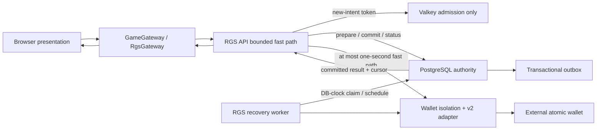

# 前后端核心架构评估

状态：当前源码架构评估与演进契约

最后更新：2026-08-22

本文评估当前仓库实际实现，区分“源码已交付”“需要继续演进”和“必须由正式环境或第三方验收”三
种状态。它不把单元测试、本机 `local-operator` 或静态 Helm 校验等同于真实资金上线认证。

## 1. 结论

当前架构的核心选择是正确的：浏览器只负责表现和可恢复交互，RGS 负责 RNG、会话、轮次、余额投
影、特性状态与顺序，PostgreSQL 负责资金相关状态和幂等证据，Valkey 只负责新意图准入。钱包慢或
结果模糊时，系统不再让同步 HTTP 一直占住请求，也不从错误文本猜测成功/失败，而是返回可恢复状
态并按持久动作继续同一经济意图。

这套设计比传统“单体请求内调用钱包 + Redis 锁 + 失败就重试”复杂，但复杂性来自真实存在的跨系
统不确定性。当前实现把不确定性变成可查询、可审计、可围栏的状态，而不是把它隐藏在超时和缓存
中。

| 能力 | 当前状态 | 结论 |
| --- | --- | --- |
| 浏览器与资金权威分离 | 已实现 | 前端不能生成网格、派彩、余额或修改服务端顺序 |
| PC/手机/平板连续适配 | 已实现核心框架 | PC authored crop、移动单次 contain 根缩放、连续移动设计域；仍需真实设备矩阵验收 |
| 客户端断线与结果恢复 | 已实现 | 同一 round ledger、状态查询、序号去重、展示 ACK |
| 原子轮次钱包 v2 | 已实现应用契约 | `atomic-http-v2`、完整命令摘要、显式结果、签名收据 |
| 慢钱包故障隔离 | 已实现应用机制 | 一秒快路径、非阻塞舱壁、独立熔断、202 持久恢复 |
| 多副本恢复调度 | 已实现应用机制 | DB clock、`APPLY/LOOKUP`、`SKIP LOCKED`、fencing、full-jitter |
| 高并发共享准入 | 已实现 | Valkey 只保护新 launch/spin，不裁决资金幂等 |
| transfer/split wallet | **未实现** | 仅保留能力边界；需要独立持久 saga 与专项认证 |
| PostgreSQL 跨 shard 扩展 | **未实现** | 单写主库仍是最终容量上限，分片必须另行设计 |
| 正式第三方钱包认证 | 外部门禁 | 本机 conformance 不能替代供应商联调、容量、灾备与对账认证 |
| AWS 正式容量与监管验收 | 外部门禁 | 必须以真实基础设施压测、故障演练和独立审批为准 |

## 2. 当前边界



关键边界如下：

1. 浏览器是不可信表现层。它可以请求、轮询、恢复和 ACK，但不能决定开奖结果或资金终态。
2. PostgreSQL 是会话、轮次、不可变钱包命令、收据、恢复阶段和 Outbox 的唯一权威。
3. Valkey miss 只意味着准入缓存没有状态，绝不意味着一局或钱包操作没有执行。
4. 钱包 HTTP 是外部副作用边界，不与 PostgreSQL 共享 ACID 事务；系统明确采用持久状态加幂等收敛。
5. 审计通过同事务 Outbox 与业务提交绑定，网络投递在事务外至少一次执行。

## 3. 后端评估

### 3.1 优势

**资金正确性优先于表面可用性。** 首次钱包外呼前，RGS 已持久化请求指纹、获批定义身份、规范结
果、结果哈希、完整钱包命令和 `commandDigest`。任何恢复都使用这些证据，不重新运行 RNG。一个
会话只允许一个待处理轮次，数据库行锁与版本检查串行化余额和特性状态迁移。

**钱包状态不再靠异常猜测。** `rgs-wallet-contract-v2` 把结果规范为 `SUCCEEDED`、
`REJECTED_FINAL`、`PENDING`、`NOT_FOUND`、`CONFLICT`、`UNKNOWN` 与 `NOT_SENT`。只有经过响应签
名验证和严格 JSON 解码的数据能产生供应商语义；网络错误、未认证响应和错误字符串只能产生不确
定或未发送分类。

**恢复动作可持久化且可围栏。** PostgreSQL 保存 `wallet_phase=APPLY|LOOKUP`、
`next_attempt_at`、apply/lookup 次数和租约。领取 `APPLY` 时先在事务内推进后续阶段为 `LOOKUP`，
因此进程在外呼后崩溃，接管者不会盲目重放资金写入。调度更新必须匹配原租约到期 token，旧 worker
无法覆盖新领取或终态。

**慢钱包不会无限拖住 RGS。** API 的首次钱包快路径默认一秒；未得到终态就返回 HTTP 202。按规范
化后端共享的 apply/lookup 舱壁分别保留 24/8 个许可，每个运营商另有 8 个 apply、4 个 lookup
许可；两条 lane 使用独立熔断器。新意图在 RNG/PREPARE 前做只读预准入，舱壁满或熔断打开时立即
返回签名的 503
`WALLET_UNAVAILABLE` 和 `Retry-After: 1`，不在进程内无界排队。

**恢复吞吐有公平性和背压。** Worker 只领取数据库判定到期的记录，在每个运营商内排序后跨运营商
轮转，再通过 `FOR UPDATE ... SKIP LOCKED` 在副本间分摊。每波领取不超过并发上限，后续动作使用
有上限指数退避与 full-jitter。被本地舱壁、熔断或配置在发送前拒绝的 `NOT_SENT` 会归还经济
`apply_attempts` 预算，但保留持久调度计数来继续扩大退避，避免故障期间形成数据库热循环。首次时
间、租约、到期判断和相对调度都使用 PostgreSQL 时钟。

**应用角色和权限边界清楚。** API 承载公网请求与有界快路径；Worker 承载钱包恢复、Outbox 和清
理；migrator 使用独立身份。运行时不持有 DDL 权限，API/Worker 使用不同 Secret 能力集合，运维监
听器与公网监听器分离。

### 3.2 缺点与深层原因

| 缺点 | 深层原因 | 当前缓解 | 不能误称为已解决的部分 |
| --- | --- | --- | --- |
| PostgreSQL 单写主库仍可能成为峰值上限 | 同一会话余额、特性和轮次天然要求有序提交；资金状态不能靠最终一致缓存裁决 | 短事务、连接预算、共享准入、状态/恢复独立容量、`SKIP LOCKED` | 连接池代理、读副本或表分区都不会增加主库写吞吐；跨 shard 尚未实现 |
| API 仍在首次请求中等待钱包最多一秒 | 正常路径希望低延迟直接返回终态，同时必须限制慢依赖占用 | 有界快路径，超时后 202 + Worker | 不是完全异步结算，也不能保证所有钱包都在一秒内完成 |
| 舱壁和熔断为每进程状态 | 进程内状态无需外部协调且故障域小 | 后端共享 lane、运营商 lane、HPA/合同容量总预算 | 多 Pod 会各有半开探针；没有集群级钱包并发令牌 |
| 恢复公平性不是租户 SLA | 当前 round-robin 只防止一个运营商占满批次头部 | 独立 operator 排名、批量和并发上限 | 没有权重、预留份额或按合同动态配额 |
| 精确 schema 清单使含迁移版本不能普通零停机滚动 | 失败关闭比新旧二进制误读资金状态更安全 | 维护窗口/协调切换、migrator verify | expand/contract 双版本协议尚需单独实现 |
| 第三方差异仍有联调成本 | 签名、幂等保留期、余额语义和 404 一致性属于供应商事实 | versioned profile、统一 adapter SPI、conformance | profile 不能凭代码替供应商做保证，必须认证 |
| transfer/split wallet 不适配当前原子命令 | debit 与 credit 分离会增加中间资金态和补偿分支 | 明确拒绝伪装成 atomic profile | 持久 saga、步骤级幂等、补偿审批与对账尚未实现 |

### 3.3 极高并发下的正确扩展顺序

1. 先用共享 Valkey 令牌桶和本机请求/连接上限拒绝超出批准容量的**新经济意图**，保留已提交结果
   查询、ACK、钱包 lookup 与运维容量。
2. 按 API/Worker 最大副本、滚动 surge、终止重叠、数据库连接、钱包 lane 和外部合同容量计算硬上
   限；下游先到顶时降低 HPA 上限，不继续扩容制造重试风暴。
3. 以真实 `pg_stat_statements`、锁等待、WAL、索引和事务 profile 优化已证明的热点，不能用对象池
   或缓存命中率替代证据。
4. 单主库在批准峰值及故障余量下仍不足时，再按稳定 `operatorId + currency` 等不可变租户边界评
   审分片；一个会话、轮次、钱包账本和 Outbox 必须同 shard。
5. 分片上线前必须交付版本化路由、迁移校验、跨 shard 对账、故障回退和真实容量演练。当前仓库没
   有这些能力，不能把路线图写成已完成。

## 4. 前端评估

### 4.1 优势

**协议边界正确。** `GameGateway` 把表现层与数据源隔离，正式 `RgsGateway` 严格解码服务端会话、
轮次和恢复结果。待处理 ledger 固定 `roundId/bet/startRevision/originFeatureState`，重提必须复用同
一份 body；已观察到轮次存在后，不再把后续 404 当作可重提授权。

**503 恢复语义已经闭合。** 对 `WALLET_UNAVAILABLE`，网关解析受限的 `Retry-After`，将其作为指
数退避下界；到期后先查权威 round 状态。只有状态 404 且会话 revision 未变时，才复用字节等价的
ledger 重提。该循环仍受 `maxPollAttempts` 硬上限约束，耗尽后保留 pending 并阻止新投注，避免为了
“自动恢复”无限发送经济请求。

**多端布局使用单一根投影。** 桌面保持固定 `1280×720` 设计域，并按原版 `1200×900` authored
composition 一次等比投影：常见 PC 高度贴满，窄视口对称裁切左右翼并发布 `visibleInsetX`。移动端按
当前物理长宽比连续生成逻辑设计域，把极端范围钳制在 `9:22..22:9`，再使用
`min(viewportWidth/designWidth, viewportHeight/designHeight)` 等比居中。`ResizeObserver`、window resize 和 `visualViewport.resize` 合并到 animation frame；DevTools
切换产生的瞬时 `0×N` 不会把布局压成 `1×1`。Pixi、DOM 和点击坐标消费同一个 snapshot。

**表现生命周期已经分层。** 游戏连接/经济状态、转轴轮次、启动流程和渲染器内部特效分别有状态
机或明确生命周期；销毁路径取消定时器、请求、动画和渲染对象。这样的边界比把所有动画写进一个
全局时间轴更容易保证断线、旋转与 feature 退出时不重放经济结果。

### 4.2 缺点与深层原因

当前快照中，`AppController.ts` 约 3696 行、`RgsGateway.ts` 约 2071 行、`PixiRenderer.ts` 约
2790 行、`style.css` 约 5781 行。大文件不是运行错误，但它表明协议恢复、游戏编排、音频、feature
表现、DOM、Pixi 与多端样式的变更半径过大。

| 缺点 | 深层原因 | 风险 | 建议边界 |
| --- | --- | --- | --- |
| `AppController` 编排职责过多 | 需要跨网关、状态机、音频、转轴、UI 和恢复维持精确顺序，功能长期累积在协调器 | 一处 feature 改动影响断线、自动旋转和销毁路径 | 提取 `RoundOrchestrator`、`FeaturePresentationCoordinator`、`AudioCoordinator`；Controller 只装配与转发 |
| `RgsGateway` 同时负责 transport、codec、token、round recovery 与 ACK | 安全校验需要共享绑定，最初集中实现更容易闭合不变量 | 重试策略修改可能误伤 token/ACK，测试组合增长 | 分成纯 `RgsTransport`、严格 codec、`RoundRecoveryLedger`、`ResultDeliveryAck`，共享不可变 session binding |
| DOM 与 Pixi 双层布局 | 官方画面既有 Canvas 动画又有可访问 DOM 控件 | 任一消费者自行算尺寸会产生漂移、点击错位 | 保持 `ResponsiveLayoutSnapshot` 为唯一几何输入，禁止子模块读取 `innerWidth` 自行缩放 |
| 单一 CSS 文件承载多端和帮助页 | 像素还原需要大量捕获规则，级联方便但所有权不清 | 全局 selector 覆盖字体/层级，媒体规则互相污染 | 按 shell/base-game/feature/help/mobile 分 layer，并为关键字体、z-index 和容器变量建立契约测试 |
| 通道判定仍含输入能力启发式 | 浏览器没有可靠的“手机/平板”布尔值，触控笔记本和 DevTools 模拟会冲突 | 边缘设备可能选择非预期构图 | 保留显式宿主 override，持续运行真实设备/浏览器矩阵；不回退到固定设备白名单 |
| 恢复耗尽会硬阻塞界面 | 资金不确定时继续投注比暂时不可用更危险 | 用户需要运营支持才能解除长时间 pending | 提供可审计支持入口与轮次引用；不得用清空本地状态或换 round 绕过 |

拆分必须先冻结现有状态、协议、视觉与销毁测试，再做无行为变化的提取。直接重写 Controller、Gateway
或 CSS 可能在代码行数下降的同时破坏资金恢复或像素时序，不应作为一次“大重构”上线。

## 5. 与常见传统方案对比

| 方案 | 优点 | 失败时的真实行为 | 本项目选择 |
| --- | --- | --- | --- |
| 单体同步事务内一直等待钱包 | 代码少、正常路径容易理解 | 外部钱包不参与 PostgreSQL 事务；慢响应耗尽本机资源，超时仍然模糊 | 一秒快路径 + 持久恢复；没有终态就不宣称完成 |
| Redis 锁/缓存作为幂等权威 | 快、实现常见 | TTL、淘汰、故障转移或双写窗口会丢失资金证据；cache miss 不能证明未执行 | PostgreSQL 唯一约束、结果和命令为权威，Valkey 只准入 |
| 失败后无限 apply 重试 | 短暂故障后可能自行恢复 | 发送后断线可能已扣款；无限重试导致重复效应和雪崩 | `UNKNOWN` 先 lookup，写尝试有硬预算和人工审核 |
| 数据库 + 消息系统双写 | 下游实时 | 任一侧成功、另一侧失败，无法证明事件与业务提交一致 | 同事务 Outbox，事务外至少一次投递 |
| 直接使用分布式 2PC | 理论上统一提交 | 外部大平台钱包通常不加入本方事务协调器；阻塞、恢复和组织边界不可控 | 版本化幂等命令、状态查询和对账收敛 |
| 每接一家钱包复制业务流程 | 首次接入看似快 | 供应商状态码渗入核心，长期出现不同幂等和恢复语义 | 统一 v2 profile/SPI，差异留在 adapter 和 conformance |
| 一开始拆成大量微服务 | 团队边界清晰时可独立发布 | 在资金状态尚未稳定时增加网络故障、版本矩阵和观测成本 | 先保持领域模块化单制品，API/Worker 按运行角色隔离 |

因此“不是传统做法”的核心原因不是技术偏好，而是三个不变量：不能因重试重复资金效果，不能因进
程崩溃重跑 RNG，不能因缓存或网络响应丢失审计证据。只要这三个条件存在，持久状态机与对账边界
就比同步调用或缓存锁更合适。

## 6. 本轮已收敛的架构缺陷

| 原缺陷 | 优化后 |
| --- | --- |
| 钱包错误只能用 `error/found` 组合推断 | v2 显式状态、能力档案、完整 `OperationRef` 与 `CommandDigest` |
| 慢钱包可占住请求直到通用 HTTP timeout | 可配置一秒快路径，未终态返回 202 |
| apply/lookup 共享下游容量，故障可相互拖垮 | 独立非阻塞 lane、运营商 apply/lookup lane、独立熔断与低基数指标 |
| Worker 周期扫描后立即重复处理 | 持久 `next_attempt_at`、DB clock、full-jitter、批量/并发硬上限 |
| 多 Worker 可能争相处理同一批候选 | 运营商公平排序、`SKIP LOCKED`、租约 fencing |
| 新意图在钱包已明显不可用时仍运行 RNG 并写 PREPARED | RNG/PREPARE 前只读准入，显式 503 `WALLET_UNAVAILABLE` |
| 浏览器对连续 503 未遵守服务端等待下限，且重提次数过早耗尽 | `Retry-After` + 指数退避，权威 404 后复用同一 ledger，统一受 `maxPollAttempts` 限制 |

## 7. 后续优先级

### P0：正式接入门禁

- 对每个真实运营商验证签名、重放、命令摘要、钱包会话、幂等保留期、权威余额、所有 v2 状态、
  `NOT_FOUND` 一致性窗口、慢响应、故障转移和日终对账。
- 在正式规模的 PostgreSQL、Valkey、入口和模拟钱包上执行稳态、2 倍突发、单区损失、RDS failover、
  熔断、恢复 backlog 和滚动发布重叠压测。
- 归档 p50/p95/p99、错误率、锁等待、WAL、连接池、恢复年龄、钱包 lane、隔离拒绝与对账证据；由
  业务、SRE、安全和运营商共同批准。

### P1：结构性维护优化

- 在不改变行为的前提下拆分 `AppController`、`RgsGateway`、`PixiRenderer` 和 CSS 所有权；每次提
  取都要求协议、状态机、视觉矩阵与销毁测试保持通过。
- 为钱包 adapter 建立供应商无关的录制式 conformance fixture，但原始抓包保留在受控本地证据区，
  不进入 Git、镜像、CI 或发布资产。
- 为恢复队列补充 backlog 数量/最旧年龄的低基数 gauge，再决定是否用于 Worker 自定义 HPA；在指
  标适配器和缺失回退交付前，继续只按 CPU/内存扩缩。

### P2：超过单主库后的演进

- 只有真实容量证据证明需要时，设计稳定租户分片和版本化路由；禁止用 Redis 锁、读副本或分区把
  分片问题包装成已解决。
- 如确有 transfer/split 钱包需求，新增独立 profile 与持久 saga，而不是扩充一个状态码分支后复用
  `atomic-http-v2` 名称。

## 8. 验证与交付边界

源码候选至少执行：

```sh
cd server
go test ./...
go test -race ./internal/rgs ./internal/wallet ./internal/recovery
go vet ./...

cd ../web
npm run typecheck
npm test -- --run --fileParallelism=false
npm run build
```

PostgreSQL 并发与迁移测试必须显式提供隔离的 `RGS_POSTGRES_TEST_URL`、
`RGS_POSTGRES_MIGRATOR_TEST_URL` 和 `RGS_REQUIRE_POSTGRES_TESTS=1`；没有凭据时的 skip 不是 pass。
集群还需执行 Chart 静态、渲染、Prometheus 规则和部署契约验证。真实浏览器必须覆盖 PC、手机、平
板的横竖屏、DevTools 连续 resize、safe-area、页面隐藏/恢复、断网和低性能设备。

这些工程验证只能证明候选符合仓库契约。真实 AWS 容量、第三方钱包、审计接收端、密钥系统、告警
终端、灾备恢复、监管/独立实验室与业务签署仍是外部门禁，不得在仓库报告中标成“已上线”。

## 9. 关联契约

- [生产架构](architecture.md)
- [轮次幂等性与故障恢复](failure-recovery.md)
- [高并发性能与数据生命周期契约](performance-optimization-contract.md)
- [RGS 多副本集群运行契约](cluster-runtime-contract.md)
- [AWS 正式生产运维](aws-production-operations.md)
- [运营商集成](operator-integration.md)
