# 轮次幂等性与故障恢复

状态：生产协议设计
最后更新：2026-08-22

本文档描述 RGS 如何在客户端重试、并发副本、进程崩溃、数据库故障转移与模糊钱包响应间避免重
复经济效应。它不承诺分布式"恰好一次"投递。系统使用持久状态加幂等效应使重复投递安全。

## 1. 持久轮次状态机

```mermaid
stateDiagram-v2
    [*] --> PREPARED: Persist fingerprint, outcome, command, phase=APPLY
    PREPARED --> WALLET_PENDING: Claim APPLY and persist phase=LOOKUP
    WALLET_PENDING --> COMMITTED: Validate signed wallet receipt and commit session
    WALLET_PENDING --> REJECTED: Deterministic wallet rejection
    WALLET_PENDING --> MANUAL_REVIEW: Conflict or invalid economic receipt
    WALLET_PENDING --> WALLET_PENDING: PENDING/UNKNOWN; schedule LOOKUP
    WALLET_PENDING --> WALLET_PENDING: Proven NOT_SENT; schedule same action
    WALLET_PENDING --> WALLET_PENDING: Authoritative NOT_FOUND; wait then APPLY same operation
    PREPARED --> MANUAL_REVIEW: Corrupt/mismatched persisted state
    COMMITTED --> COMMITTED: Exact idempotent replay
    REJECTED --> REJECTED: Terminal replay
    MANUAL_REVIEW --> MANUAL_REVIEW: Session remains blocked
```

`PREPARED` 在任何钱包副作用前写入。它包含不可变请求指纹、完整规范游戏结果、其 SHA-256 结果
哈希与确切钱包命令。因此恢复绝不再为该轮次调用 RNG。

`WALLET_PENDING` 意味着钱包命令可能已提交也可能未提交。轮次额外持久化 `wallet_phase`、
`next_attempt_at`、独立的 apply/lookup 次数和完整 `wallet_command_digest`。一个 worker 只能领取存储
层指定的 `APPLY` 或 `LOOKUP` 动作；领取 `APPLY` 时，PostgreSQL 在外呼前先把后续阶段推进为
`LOOKUP`。因此进程在发出资金请求后崩溃，接管者也只能查询原操作，不能盲目重扣。

领取结果携带数据库生成的租约到期值作为 fencing token。调度下一次动作必须原样匹配该 token；
旧 worker 的迟到写入不能覆盖新领取或终态。租约、首次到期时间、到期判断与相对延迟统一使用
PostgreSQL `clock_timestamp()`，容器时钟偏差不参与资金调度裁决。

`COMMITTED` 是唯一暴露可赔付结果的状态。事务原子地存储钱包收据、更新会话余额快照、版本、序
号、特性状态与待处理轮次标记，并追加发件箱事件。

持久化的特性状态是完整的经济/表现恢复投影：模式、剩余与授予旋转、锁定投注、累计特性获胜与
Rage 等级/计数。因此重启不能重置 Free Spins 获胜计数器或把猿形返回到错误的 PPS 空闲等级。

`MANUAL_REVIEW` 阻塞会话。它对任何幂等冲突、无效/不匹配的签名收据、结果哈希不匹配、不可能
状态迁移、耗尽的钱包尝试预算或运营商指示的调查都是必需的。它绝不能被自动清除。

## 2. 经济身份

客户端重试身份是 `(operatorId, sessionId, roundId)`。请求指纹额外绑定：

- 指纹格式版本；
- 游戏 ID、定义版本与定义 SHA-256 哈希；
- 货币与轮次类型；
- 最小单位投注；以及
- 起始会话版本。

钱包操作 ID 与持久化命令也绑定玩家、钱包账户、扣款、收款、结果指纹与服务端事务 ID。相同身
份加相同数据是重放；相同身份加任何不同字段是硬冲突。指纹格式变更需要显式版本迁移，而非静默
算法替换。

会话允许一个待处理轮次。这串行化余额与特性状态迁移，而不依赖进程本地互斥。PostgreSQL 行锁与
版本检查是跨副本权威。

## 3. 客户端重试协议

| 观测 | 客户端动作 | 禁止动作 |
|---|---|---|
| HTTP 200 + `COMMITTED` | 按序号持久化/投影结果；动画一次 | 本地重算获胜 |
| HTTP 202 + `ROUND_PENDING` | 有界退避（在存在时遵守 `Retry-After`），然后用相同 session/round 查状态 | 开始另一轮次 |
| HTTP 503 + `WALLET_UNAVAILABLE` | 至少等待合法 `Retry-After`，查询同一 round；仅当权威状态为 404 时用字节等价账本身份重提 | 换 `roundId`、投注或起始版本 |
| 网络超时/重置 | 用相同 `roundId` 重试确切旋转，或查状态 | 生成替换 `roundId` |
| HTTP 409 过期版本 | 拉取/恢复当前状态并停止控件 | 改版本并重提旧意图 |
| HTTP 409 幂等冲突 | 停止会话并升级 | 猜测哪个请求赢了 |
| HTTP 409 + `ROUND_REJECTED` 确定性拒绝 | 显示稳定映射消息；不动画 | 当作传输重试 |
| `MANUAL_REVIEW` | 禁用投注并使用支持/事件流程 | 继续 free spins 或基础玩法 |
| 过期 token | 通过运营商重新启动 | 不经运营商策略检查复用/刷新 token |

表现去重使用已提交的 `sequence` 与事件的数组位置。重放结果可恢复投影状态，但绝不能在客户端已
确认该序号后重放音频、粒子或获胜庆祝。

## 4. 钱包模糊协议

HTTP 超时意味着 `UNKNOWN`，绝不意味着失败；只有能证明在 HTTP 请求发出前失败，才能返回
`NOT_SENT`。钱包 v2 适配器不得从错误字符串或状态码猜测经济终态，只有通过签名认证并严格解码的
响应才能产生供应商语义：

| v2 结果 | 持久恢复动作 | 资金含义 |
| --- | --- | --- |
| `SUCCEEDED` | 校验收据并提交原始结果 | 唯一成功终态 |
| `REJECTED_FINAL` | 拒绝轮次 | 供应商明确未执行的业务终态 |
| `PENDING` / `UNKNOWN` | `LOOKUP` | 可能已执行，不得再次写入 |
| `NOT_SENT` | 保持本次 claim 的动作 | 已证明未跨过网络发送边界 |
| `NOT_FOUND` | 仅查询阶段可处理；等待能力档案的最短一致性窗口后，以相同命令重排 `APPLY` | 不能把瞬时 404 直接当作未执行 |
| `CONFLICT` 或无效结果 | `MANUAL_REVIEW` | 身份或协议不再可信 |

当前已实现的能力档案是 `rgs-wallet-contract-v2` / `atomic-http-v2`。它要求原子扣款与派彩、按完整
`operationId` 查询、权威余额、`walletSessionRef`、`commandDigest` 和签名响应；同一操作在权威
`NOT_FOUND` 后允许重提，但必须至少等待一秒一致性窗口并复用原始命令。能力档案在准入时锁定，
不能在一次恢复过程中根据错误动态降级。

`apply_attempts` 与 `lookup_attempts` 分开持久化。`RGS_WALLET_MAX_ATTEMPTS` 分别限制进一步的
APPLY 与 LOOKUP 外部调用（默认 `100`，有效 `1..10000`）；下一次领取超过对应预算时，协调器会在
发出另一笔写请求或查询前进入 `MANUAL_REVIEW`。查询不会消耗新经济意图，但也不能成为无界外部
调用；它仍受单次超时、Worker 批量/并发上限、持久指数退避与运维截止约束。只有适配器能够证明
请求未越过发送边界的 `NOT_SENT` 才归还预占的 `apply_attempts`；持久调度计数不归还，继续驱动
指数退避，防止熔断或本地配置故障形成数据库热循环。进程重启或不同副本不重置这些调度证据。
运营商必须调查现有操作 ID；绝不能临时提高限额、删除轮次或创建替换经济意图。

恢复领取不再为每个批次扫描全部待处理轮次并补种运营商。
`0010_wallet_recovery_registry_invariant` 先锁定并回填既有待恢复轮次，再安装永久数据库触发器：
INSERT 已处于恢复态的轮次会注册公平游标，只有从非恢复态 UPDATE 进入恢复态时才再次注册，因此
触发器的 `PREPARED → WALLET_PENDING` 分支不产生第二次注册。触发器与轮次写入同事务提交或回滚，
并覆盖滚动期间尚未退出的旧 writer；`PREPARE` CTE 仍执行一次有界主键冲突探测，只防护目录漂移后、
readiness 摘流前的短窗口。迁移提交前、migrator `verify` 和运行时 `SchemaCheck`/readiness 都会动态
核对精确函数及两条已启用触发器，禁用、删除或替换任一对象即失败关闭。除非先提供等价数据库级
不变量，后续迁移不得删除它。该保证只覆盖恢复注册不漏项，不是任意 schema/应用版本可以长期混跑
的证明。

该能力只覆盖**原子轮次钱包**。转账钱包、分离 debit/credit、预授权/捕获、跨账户转移或外部两阶
段事务均未实现；它们需要独立的持久 saga/补偿状态机、步骤级幂等键、对账和认证，不能伪装成
`atomic-http-v2` 或在失败时拆成两个普通 HTTP 调用。

在任何恢复轮次可到达钱包前，仓库严格解码持久化结果并交叉校验其请求指纹、已准备结果哈希、事
务身份、投注、扣费金额、获胜金额、版本、序号与收据派生列。未知 JSON 字段与部分钱包收据列失
败即拒绝。不匹配发出 `ROUND_INTEGRITY_FAILED`、阻塞所属会话并把每个未结算轮次隔离为
`MANUAL_REVIEW`；恢复 worker 绝不能为该行发出经济调用。若腐败行已经济终态，其
`COMMITTED`/`ROLLED_BACK` 状态与钱包账本被保留，同时会话被阻塞以供调查。
运营商与客户端轮次状态端点使用协调器的状态服务，而非仓库直接。一个首次检测到腐败的状态轮询
执行相同幂等隔离，但绝不评估游戏数学、认领钱包租约或调用钱包。

会话读取也失败即拒绝。PostgreSQL 严格解码 `feature_state` 并拒绝未知字段，在 launch 重放、交
换、刷新、旋转、提交或恢复可继续前应用规范会话与特性不变式。畸形持久会话状态的首个读取者原
子地把会话设为 `BLOCKED`、写入其 `integrity_quarantined_at` 标记，并追加一个
`SESSION_INTEGRITY_FAILED` 发件箱事件。它刻意保留余额快照、序号、版本、特性文档、待处理轮次
指针、轮次状态与钱包账本状态作为对账证据。重复与并发读取者返回 HTTP 423 `MANUAL_REVIEW` 而
不产生重复事件或指标，且恢复枚举排除被隔离会话。会话完整性错误在协调器内部是独立的，因此它
不会把它们误认为轮次腐败并重写待处理经济行。

回滚不是超时处理器。它是一个显式、审计过的补偿操作，有自己的稳定回滚 ID 与职责分离审批。自
动回滚后重放可能产生第二次收款或扣费，被禁止。

## 5. 崩溃点恢复

| 崩溃点 | 持久证据 | 恢复 |
|---|---|---|
| `PREPARED` 提交前 | 无轮次行 | 确切客户端重试可创建轮次 |
| `PREPARED` 后、领取前 | 规范结果 + `phase=APPLY` | 认领租约并应用原始命令 |
| `APPLY` 领取后、钱包调用前 | 已持久推进 `phase=LOOKUP` | 保守查询；权威 `NOT_FOUND` 经窗口后才恢复原 `APPLY` |
| 钱包调用期间/后、收据提交前 | `WALLET_PENDING` + `phase=LOOKUP`；经济结果未知 | 按完整持久身份查询同一操作 ID |
| 收据/会话提交后、客户端响应前 | `COMMITTED` 规范结果 | 确切重放返回存储结果 |
| 领域提交后、事件发布前 | 未发布发件箱行 | 分发器重试事件；绝不重复钱包效应 |

恢复 worker 必须在每个副本都可安全运行。PostgreSQL 只选择 `next_attempt_at` 已到期且租约空闲
的行，按运营商内顺序排名后跨运营商轮转，并以 `FOR UPDATE ... SKIP LOCKED` 让副本分摊工作。
Worker 每波最多领取 `MaxParallel` 条，在 `BatchSize` 总预算内并行处理；非终态以独立动作次数计算
有上限的指数退避，并从 `[0, upperBound]` 选择 full-jitter。能力档案一致性窗口和合法
显式 not-before（若某适配器未来提供）都是下界，不能被抖动缩短；当前原子 HTTP v2 只使用前者，
不宣称已经消费供应商 `Retry-After`。恢复必须在关闭期间干净停止，并通过租约过期而非不安全删除
释放执行权。

## 6. 发件箱与下游消费者

轮次/会话提交与发件箱插入共享一个数据库事务。分发器至少一次发布。每个消费者按发件箱 ID 或
稳定聚合事件身份去重。下游分析、审计导出与玩家历史绝不能放在钱包提交事务内。

生产运行时使用签名 `rgs-outbox-http-v1` 契约、受控租约、有界并行、硬发布截止与持久指数重
试。生产配置在缺少外部 sink 时失败即拒绝。见
[`outbox-delivery.md`](outbox-delivery.md) 的精确封套、签名、就绪与轮换契约。

不要把玩家、会话、轮次、钱包或事务标识符作为 Prometheus 标签。把关联 ID 保留在有访问控制、
有记录保留与脱敏策略的结构化日志中。

进程内计数器有刻意狭窄的语义：

- `rgs_rounds_prepared_total`、`rgs_rounds_committed_total`、
  `rgs_rounds_manual_review_total` 仅在仓库调用报告它持久执行了该状态迁移时递增。观察到现
  有状态的并发重试不再递增它们。
- `rgs_round_replays_total` 计数一个未准备新轮次并成功返回规范已提交结果的协调器请求。
  `rgs_idempotency_conflicts_total` 计数可靠分类的轮次或钱包幂等冲突；普通状态读取既非重放
  也非冲突。
- `rgs_wallet_calls_total` 计数实际钱包适配器方法调用。
  `rgs_wallet_unknown_outcomes_total` 计数返回 `UNKNOWN` 的 v2 submit/resolve 调用；显式未发送、
  拒绝、冲突、无效收据与成功被排除。
- `rgs_wallet_request_duration_seconds`、`rgs_wallet_inflight`、
  `rgs_wallet_isolation_rejected_total` 与 `rgs_wallet_breakers` 只使用固定 method/outcome/reason/state
  枚举，分别观察外呼时延、执行中请求、非阻塞舱壁拒绝和 apply/lookup 熔断状态。
- `rgs_recovery_backlog` 与 `rgs_recovery_oldest_due_age_seconds` 来自每个 Worker 对同一数据库全局状态的
  有界快照。首次快照在 `[0, 15s)` 内使用进程随机抖动错峰，后续保持十五秒固定周期；恢复 pass 本身
  仍在 Worker 启动时立即执行。查询按恢复 partial index 顺序最多保留 501 个持久调度行，因此 backlog
  是封顶下界：`501` 表示实际积压至少为 501，而不是精确总数；最早 `next_attempt_at` 仍是全局最早
  持久调度行，并使用数据库时钟计算逾期年龄。会话绑定由领取事务完整校验；失配调度行不会被观测
  静默过滤。`rgs_recovery_snapshot_last_success_timestamp_seconds` 使用
  同一次读取返回的数据库时钟；快照使用一秒硬截止，失败保留上一份值并递增
  `rgs_recovery_snapshot_failures_total`，但不得改变已经完成的资金恢复 pass 结果。多副本告警只能对
  同 `instance` 时间戳小于六十秒的新鲜样本取 `max`，不能求和，也不能让陈旧高值覆盖新鲜低值。
- `rgs_recovery_loop_last_success_timestamp_seconds` 在每次恢复 pass 成功完成后独立前进；pass 失败递增
  `rgs_recovery_loop_failures_total`。这把“恢复执行停止”和“观测查询停止”分成两个可操作故障域；正常
  关闭的 `context.Canceled` 不计失败。API-only 角色不输出任何 `rgs_recovery_*` 指标，避免伪造健康
  零值。
- `rgs_round_integrity_quarantines_total` 在 PostgreSQL 提交一轮次的首次持久完整性隔离标记
  时递增。它也覆盖 `COMMITTED`/`ROLLED_BACK` 状态必须保留的腐败经济终态轮次；重复读取同一
  腐败行不递增它。
- `rgs_session_integrity_quarantines_total` 在 PostgreSQL 提交一会话的首次持久完整性标记时
  递增。它无运营商/会话标签；对应发件箱事件携带访问控制审计身份。
- 发件箱认领计数器计数已租约投递尝试，包括后续重试。已发布/已延迟计数器仅计数存储确认的完
  成，租约丢失计数被隔离的过期完成。一个持久 `integrity_quarantined_at` 标记防止重复读取一
  个腐败轮次发出重复完整性事件或人工审核迁移。

`MANUAL_REVIEW` 当前没有自动退出或“已处理”状态，因此 `rgs_rounds_manual_review_total` 只表示首次
持久转换事件，不伪造 outstanding gauge。若商业审核流程需要当前待办数，必须先交付独立、可审计的
case acknowledgement/resolution 状态机，再统计未关闭 case。

这些计数器和 gauge 是运维遥测，不是结算账本：进程可能在数据库提交后、递增内存前终止。经济对账必须继
续使用 PostgreSQL 轮次、钱包账本记录与发件箱证据。

## 7. 运维对账

自动化报告按运营商与货币比较：

- 已提交 RGS 服务端事务 ID 与结果哈希；
- 钱包操作/账本事务 ID、扣款、收款与结果余额；
- 待处理/未知年龄与重试计数；
- 回滚 ID 与审批；以及
- 发件箱投递状态。

不允许跨货币净额。不匹配开启事件、在适当时阻塞受影响会话/轮次、保留所有证据，并使用获批运
营商 runbook 解决。绝不通过手动编辑规范结果或数据库余额快照修复差异。

## 8. 必需的故障注入测试

上线前至少测试：

- 跨多个 RGS 进程对一轮次的 50+ 并发字节等价请求；引擎与钱包各创建一个经济结果；
- 相同 round ID 加改变的投注、类型、定义哈希或版本；
- 在每个迁移点与提交期间故障转移的数据库断连；
- 钱包处理前、账本提交后与返回 body 期间超时；损坏/过期响应签名；畸形与超大响应；
- `NOT_SENT` 保持原动作、`UNKNOWN` 转查询、权威 `NOT_FOUND` 一致性窗口和不同命令摘要冲突；
- 多副本按数据库时钟领取、`SKIP LOCKED` 不重复并发执行、旧 fencing token 无法覆盖新调度、运营商
  公平排序和 full-jitter 上下界；
- prepare 后、apply 期间、钱包成功后与数据库提交后 RGS 终止；
- launch code 双交换与跨独立副本 nonce 重放；
- 发件箱重复发布与消费者重启；以及
- 在 `RGS_WALLET_MAX_ATTEMPTS - 1`、确切耗尽与跨副本并发耗尽时的恢复；时钟漂移、密钥轮换与
  运营商钱包幂等记录恢复。

测试证据仅支持工程信心。独立实验室与监管/运营商审批流程决定其是否满足目标辖区。
