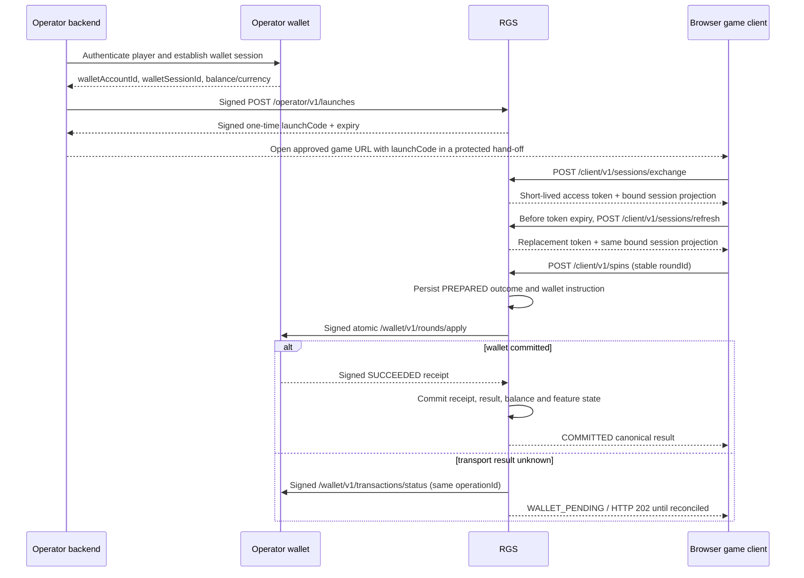

# 运营商集成指南

状态：集成草案
最后更新：2026-07-26

本指南为新净室 RGS 定义中性集成边界。规范 HTTP 草案为
[`../server/openapi.yaml`](../server/openapi.yaml)。它刻意与任何第三方游戏协议无关。

> 本仓库未认证或未授权用于真实货币运营。在接受投注前，每个部署需要适用的运营商/供应商牌照、
> 针对确切游戏定义与二进制的独立 RNG 与数学认证、独立安全评估，以及测试过的钱包适配器加每个
> 运营商的一致性签收。

## 1. 信任与所有权模型

| 职责                                                   | 运营商                   | RGS                                               |
| ------------------------------------------------------ | ------------------------ | ------------------------------------------------- |
| 玩家认证、年龄/身份检查、AML、制裁、地理与责任博彩控制 | launch 前拥有并强制      | 拒绝缺失/无效 launch 声明；不替代这些控制         |
| 钱包账本与资金可用性                                   | 拥有权威账本             | 发出一个原子扣款/收款指令，仅信任已校验的签名收据 |
| 可赔付结果、特性状态与不可变游戏定义绑定               | 绝不覆盖                 | 权威                                              |
| 浏览器动画与声音                                       | 托管或 launch 获批客户端 | 仅提供服务端事实；表现不能改变经济性              |
| 辖区配置与允许的游戏/投注                              | 提供获批策略             | 强制会话绑定与游戏限制                            |
| 对账                                                   | 暴露幂等钱包状态         | 持久化轮次状态并按操作 ID 解析模糊调用            |

认证运营商身份来自已校验密钥。服务端不从未校验的 JSON 或 header 值选择租户。

## 2. 集成序列



launch code 是密钥与一次性凭据，而非会话 ID。不要把它放在分析、带 referrer 的 URL、支持截图
或日志中。优先用运营商页面通过受保护同源 hand-off 把它交付给浏览器。若壳使用 URL fragment，
在加载第三方资源前用 `history.replaceState` 移除它。

## 3. 准入数据

通过认证管理通道带外交换以下内容。绝不在邮件或集成 API 中发送私钥。

1. 稳定 `operatorId`、环境、RGS origin 与钱包 base URL。
2. `HTTP_REQUEST` 的运营商 Ed25519 公钥，带唯一 `keyId`、`notBefore`、`notAfter`。
3. `HTTP_RESPONSE` 的钱包 Ed25519 公钥。
4. 钱包将信任的 RGS 请求签名公钥。
5. 运营商后端将信任的 RGS 响应签名公钥。
6. 允许的浏览器 HTTPS origin、辖区、货币与货币指数。
7. 获批 `gameId`、确切规范数学定义文件、不可变定义版本、SHA-256 定义哈希、允许的投注、生产签名
   `rgs-definition-approval-v2` 封套、其独立管理的 Ed25519 验证密钥，以及至少一个数学报告、RNG
   报告和逐辖区审批的外部引用。开发/预发布可继续使用 v1；生产拒绝 v1 与带 `demo` 标记的身份。
8. 运维联系、对账升级路径、维护窗口与密钥泄露程序。

密钥 ID 按用途限定，绝不能静默复用于不同密钥材料。带重叠窗口轮换：发布并测试新公钥，开始用
它签名，保留旧验证密钥直到所有签名与 token 过期，再撤销它。把生产私钥存于 KMS/HSM 或等价托
管签名服务；示例文件挂载仅是适配器边界。RGS 浏览器 access-token 密钥按运营商独立拥有；见
[`access-token-key-rotation.md`](access-token-key-rotation.md) 的确切配置与滚动
序列。生产不会用遗留共享密钥运营商文档启动。

RGS 还要求一个 32 字节 launch HMAC 密钥，通过 `RGS_LAUNCH_HMAC_KEY_FILE` 以规范标准 Base64
提供，每个副本相同共享。它从运营商、会话与 handoff 幂等身份派生不可猜测凭据；它绝不与运营商
交换。在整个 launch 幂等保留窗口内保持该密钥稳定。计划轮换时，停止用旧密钥签发，并等待至少
最大五分钟 launch TTL 加 25 小时保留期，再在所有副本上替换它。紧急泄露轮换有意使未完成
launch 与保留重放失效，因此需要事件 runbook。

钱包使用私有 CA 时，以 `RGS_WALLET_ROOT_CA_FILE` 给每个 RGS 副本只读挂载 PEM 信任根。
该信任根只进入钱包专用 HTTP 客户端，不替代系统全局信任配置；配置后的文件若缺失、不是普通
文件、超过 1 MiB 或不含有效证书，RGS 必须失败闭合并拒绝启动。钱包 URL 仍必须使用 HTTPS，
证书主机名必须与运营商文档中的钱包 base URL 一致，不能用该选项关闭链或主机名验证。

## 4. 固定请求签名 profile

运营商到 RGS 与 RGS 到钱包的调用使用一个刻意狭窄的 Ed25519 HTTP 消息签名 profile。线上实现不
是通用签名协商层。

必需属性：

- `Content-Type` 恰好为 `application/json`。
- HTTP 方法大写，无签名端点使用查询串。
- `Content-Digest` 为 `sha-256=:` 加标准填充 Base64 加 `:`，覆盖确切传输字节。
- `X-Operator-Id`、`X-Request-Id`、`X-Nonce`、`Idempotency-Key` 各出现一次。
- `X-Nonce` 密码学随机，并在签名校验后在共享存储中原子消费。
- `created` 与 `expires` 为 Unix 秒。有效窗口最多五分钟；用短得多的窗口（适配器当前对钱包调
  用签名一分钟）并保持所有主机同步到可信时间源。
- 覆盖的请求组件，按此确切顺序：

```text
("@method" "@authority" "@path" "content-digest" "content-type" "x-operator-id" "x-request-id" "x-nonce" "idempotency-key")
```

签名输入确切为：

```text
sig1=("@method" "@authority" "@path" "content-digest" "content-type" "x-operator-id" "x-request-id" "x-nonce" "idempotency-key");created=1720000000;expires=1720000060;keyid="op-request-2026-01";alg="ed25519"
```

按仓库实现描述，从小写 authority、转义 path、单一 header 值与签名参数构建规范 payload。用
Ed25519 签名规范 UTF-8 字节并把结果格式化为 `Signature: sig1=:<padded-base64>:`。在解析或处理
JSON 前校验摘要与签名。不要在摘要计算与传输间重新生成或重序列化 body。

认证服务端到服务端边界的响应用对应固定响应 profile 覆盖，按顺序：

```text
("@status" "content-digest" "content-type" "x-request-id")
```

响应 `X-Request-Id` 必须等于请求值。即使在非 2xx 状态也先校验响应签名再信任状态或错误
body。运营商准入控制错误（含 HTTP 429）留在该签名响应边界内。

进程级容量闸门是明确的例外：它在运营商身份、签名和 nonce 解析前，可能返回通用、未签名、无
业务数据的 HTTP 503 `SERVICE_UNAVAILABLE` 与 `Retry-After`。这只是 transport/admission 背压，
不是已认证业务响应；绝不能据此推断请求是否在别处被接受、nonce 是否被消费或 launch/round 是否
产生副作用。等待 `Retry-After` 后，按不确定传输规则优先查询可查询状态，或保持业务 body 与
`Idempotency-Key` 不变并使用新的 `X-Nonce`、`X-Request-Id`、`created`/`expires` 和签名重试；
不得创建新的 session/round 身份来“绕过”背压。

另一未签名失败关闭响应是 RGS 无法安全选择或使用租户响应密钥时的最小 HTTP 503
`RESPONSE_SIGNING_UNAVAILABLE` 封套；它不释放任何缓冲响应数据。`/operator/` 命名空间下的未知
路径通常也留在同一租户响应签名边界内，并在可选租户密钥时返回签名、无数据的 `NOT_FOUND`
封套，但仍可能在解析前被容量闸门拒绝。

## 5. Launch 与客户端规则

仅在运营商完成所有玩家与策略检查后调用 `POST /operator/v1/launches`。请求把一次 launch 绑定
到：

- 运营商、玩家、钱包账户与钱包会话；
- 游戏 ID、定义版本与定义 SHA-256 哈希；
- 货币与货币指数；
- 辖区与会话过期；以及
- 用于表现的钱包来源余额快照，而非钱包账本替代。

对 launch 创建，为一次浏览器 handoff 用稳定签名 `Idempotency-Key`。它独立于 body `sessionId`；
现有集成可用会话 ID 作首次 handoff。丢失响应时保持该密钥与 JSON body 不变，使重试在 RGS 副本
间收敛到相同 launch code 与原始 `expiresAt`。nonce 在验签并通过可信运营商准入后、任何业务副作
用前消费：已准入请求的重试必须使用新的 `X-Nonce`、`X-Request-Id`、`created`/`expires` 与签名，
不能逐字节重放原 HTTP 请求。唯一例外是经过签名的 HTTP 429：RGS 保证该拒绝未消费 nonce 且未
进入业务服务，在签名仍有效时可按 `Retry-After` 原样重试。用不同业务请求数据复用密钥是幂等冲突。
幂等身份由认证运营商与持久会话以及密钥划定。

RGS 把 launch-code 摘要作为幂等墓碑保留到其 `expiresAt` 后 25 小时。在该窗口内，确切重试返回
原始响应，即使 code 已被消费或过期；它绝不扩展或重新激活该 code，exchange 仍拒绝它。保留清理
可晚跑但绝不早跑。声明窗口后无重放保证；届时不可扩展会话的最大寿命也已结束。

在该一次性 code 被消费或过期后，用新密码学随机幂等标识符与相同持久会话绑定创建下次 handoff。
RGS 返回新 code 而不创建、重置或扩展现有会话。它拒绝为过期、关闭或阻塞会话重新 launch；
`MANUAL_REVIEW` 绝不能通过请求另一 code 绕过。

`balanceMinor` 与 `sessionTtlSeconds` 是仅创建的 bootstrap 输入。重新 launch 时，持久化余额与
绝对会话过期是权威；不同提供值对持久状态被忽略，绝不重置余额或扩展会话。它们仍是签名请求指纹
的一部分，因此重试一个 handoff 密钥时保持不变。

一次性 code TTL 默认两分钟，不超过五分钟。exchange 响应 token 默认 15 分钟，不超过一小时。
token 绑定到运营商、玩家、钱包会话、RGS 会话、游戏、定义版本/哈希、货币/指数、辖区、签发
者、受众、过期与唯一 token ID。它是固定 RGS compact token，非通用 JWT；不要把它喂给宽松 JWT
中间件。

长会话（含 free-spin 特性）通过 `POST /client/v1/sessions/refresh` 续约访问。请求必须携带当
前有效旧 Bearer token 与 exchange 返回的确切完整会话绑定：运营商、会话、游戏、定义版本/哈
希、货币/指数与辖区。成功响应有与 exchange 相同的 `data.accessToken` 与 `data.session` 形
状。替换保持绑定到相同玩家与钱包会话，持续不超过 `RGS_ACCESS_TOKEN_TTL`，并被裁剪到持久会话
的 `expiresAt`；refresh 绝不扩展该会话。

主动 refresh，每个客户端一个在飞 refresh，并仅在 HTTP 200 后替换内存 token。token 的 `exp`
claim 仅可解码为调度提示；服务端保持权威。无过期 token 宽限路径：HTTP 401 需要新运营商
launch，HTTP 410 表示持久会话过期，HTTP 423 表示会话 BLOCKED/`MANUAL_REVIEW`。在每个失败情况
下，停止投注提交并为获批恢复流程保留服务端特性/轮次状态。

浏览器规则：

- 把 token 保存在内存；不要放进 URL、无显式 CSRF 设计的 cookie、`localStorage`、分析或崩溃
  报告。
- 发送 `Authorization: Bearer <token>` 与新鲜 `X-Request-Id`。
- 在 `exp` 前安全 refresh token，尤其在长表现或自动 free-spin 序列前；绝不等它过期。
- 在投注前生成唯一 `roundId` 并持久化到恢复终态响应。
- 超时时，用相同 `roundId` 重试字节等价旋转，或调用 `POST /client/v1/rounds/status`。绝不仅
  因响应丢失就生成替换轮次。
- 在 RGS 返回 `COMMITTED` 规范结果前绝不呈现获胜、余额、网格或特性变更。
- 把 `MANUAL_REVIEW` 当作硬会话阻塞，把玩家交给稳定、非经济支持状态。

返回的 `feature` 投影是完整恢复状态，而非显示提示。它含 `mode`、`remaining`、`awarded`、
`betMinor`、运行中 `winMinor`、`rageLevel`、`rageCollected`。抓取的 Rage 空闲等级为 `1`。在
恢复自动 Free Spins 前恢复该投影。按数组位置呈现有序结果 `events` 并按
`(sequence, event index)` 去重；尤其中间 Vault 揭示/升级事件不可赔付，只有 `vault.awarded`
携带其金钱。见 [`gameplay-rules.md`](gameplay-rules.md) 的封闭玩法序列。

## 6. 钱包适配器契约

每个运营商需要一个适配器并必须通过一致性套件；仅有相同 JSON 形状不充分。RGS 仅发 `POST` 请
求：

| 路径                               | 用途                               | 必需幂等                             |
| ---------------------------------- | ---------------------------------- | ------------------------------------ |
| `/wallet/v1/rounds/apply`          | 原子应用一个已准备结果的扣款与收款 | `operationId` 加不可变 `fingerprint` |
| `/wallet/v1/transactions/status`   | 不重复经济意图地解析模糊 apply     | 确切 `operationId`                   |
| `/wallet/v1/transactions/rollback` | 显式运维控制的补偿                 | 唯一 `rollbackId`；超时后绝不自动    |

`/wallet/v1/rounds/apply` 请求字段为：

```json
{
  "operationId": "tx_...",
  "fingerprint": "...",
  "operatorId": "operator-a",
  "playerId": "player-ref",
  "walletAccountId": "wallet-ref",
  "rgsSessionId": "session-ref",
  "roundId": "round-ref",
  "gameId": "iron-colossus",
  "gameDefinitionVersion": "approved-version",
  "gameDefinitionHash": "64-lowercase-hex-characters",
  "roundKind": "BASE",
  "currency": "EUR",
  "debitMinor": "100",
  "creditMinor": "250"
}
```

钱包必须在一个账本事务中应用扣款与收款。重放相同 `operationId` 与 fingerprint 返回原始收据而
无新账本条目。用任何不同经济字段复用操作 ID 返回 HTTP 409 并触发人工审核。

成功为 HTTP 200 带签名、严格 JSON 收据：

```json
{
  "status": "SUCCEEDED",
  "operationId": "tx_...",
  "fingerprint": "...",
  "transactionId": "operator-ledger-ref",
  "operatorId": "operator-a",
  "currency": "EUR",
  "debitMinor": "100",
  "creditMinor": "250",
  "balanceMinor": "10450"
}
```

RGS 在提交前针对已准备指令校验每个回显字段。资金始终为最小单位的非负十进制字符串，必须适合
有符号 64 位存储。不接受小数点、指数、符号或 JSON 数字。

钱包状态含义：

|               HTTP | 含义                                              |
| -----------------: | ------------------------------------------------- |
|                200 | 终态 `SUCCEEDED`/`ROLLED_BACK` 收据，已签名可重放 |
|                202 | 已接受或仍 pending；RGS 继续对账                  |
|                404 | 操作未知；仅此不授权新轮次                        |
|                409 | 相同幂等身份与不同数据冲突；人工审核              |
|                422 | 确定性策略拒绝，如资金不足                        |
| 其他/超时/签名损坏 | 模糊或无效结果；绝不假设失败，绝不重摇            |

钱包必须保留状态/幂等记录至少适用于运营商的最长监管争议与对账期。

## 7. 一致性门禁

运营商仅在以下全部在带生产等价签名与钱包行为的隔离环境通过后启用：

1. 有效请求与响应签名、字节篡改、错误租户、错误用途、非活跃/已轮换密钥、过期时间戳、重复
   header、坏摘要、重放 nonce 与不支持查询测试。
2. launch、apply、status、rollback 与客户端旋转的确切幂等重放与冲突测试。
3. 提交前钱包超时、提交后超时、连接重置、重复投递、乱序响应、畸形 JSON、无效收据与
   202-to-200 对账测试。
4. 跨多 RGS 副本并发重复旋转与会话单待处理轮次强制。
5. 货币指数、投注限制、资金不足、零扣费 free spin、会话过期、token 过期、主动 refresh、
   refresh 绑定篡改、refresh TTL 裁剪、BLOCKED/过期 refresh 与辖区拒绝测试。
6. 计划数据库/钱包停机、每个持久状态点 RGS 重启、密钥轮换、配置钱包尝试耗尽、回滚审批与人工
   审核 runbook 演练。
7. 独立认证产物、获批定义哈希、二进制/镜像摘要、安全报告、可观测性、保留、备份/恢复与事件
   响应审批记录于变更控制。

仅通过仓库单元测试不是运营商一致性，也不是监管认证。

## 8. 生产切换清单

- 按 digest 锁定容器镜像并生成/存储 SBOM 与 provenance。
- 通过评审过的发布流程跑迁移并校验备份恢复。
- 用带托管 HA、加密传输/存储与监控连接限制的 PostgreSQL；正式入口不得使用测试内存存储。
- 在进程或可信 upstream 配置 TLS，并仅允许确切 HTTPS 浏览器 origin。禁止通配 CORS。
- 把 `/readyz` 与 `/metrics` 限制到编排/运维网络。
- 为每个副本用共享持久 nonce 存储；内存 nonce 存储仅开发用。
- 通过 `RGS_DEFINITION_FILE` 加载确切数学 JSON、通过
  `RGS_DEFINITION_APPROVAL_FILE` 加载签名 `rgs-definition-approval-v2` `APPROVED` 封套、通过
  `RGS_DEFINITION_APPROVAL_PUBLIC_KEY_FILE` 加载其独立挂载 Ed25519 验证密钥。签名与所有定义
  身份/哈希以及数学、RNG、辖区证据引用必须匹配。缺失或不匹配文件必须失败启动。代码只认证这些
  引用的签名绑定，不证明引用内容真实、充分或已获监管接受。
- 演练钱包未知结果、幂等冲突、钱包尝试接近 `RGS_WALLET_MAX_ATTEMPTS`、`MANUAL_REVIEW`、就绪
  失败与对账滞后的告警。
- 记录运营商专属上线审批；不要从通用适配器或另一运营商测试结果推断审批。
